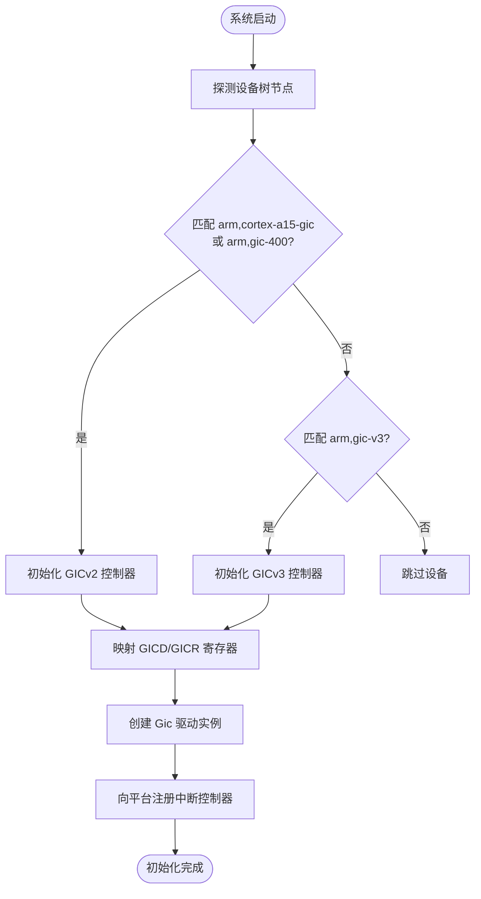
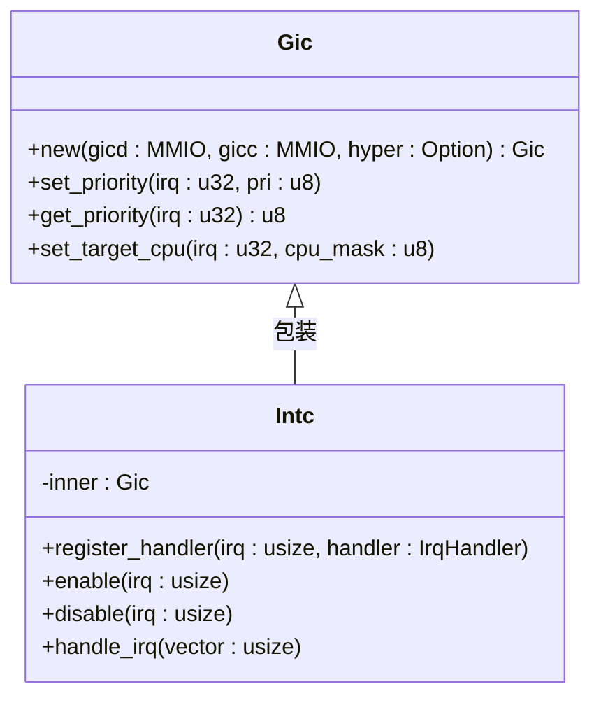
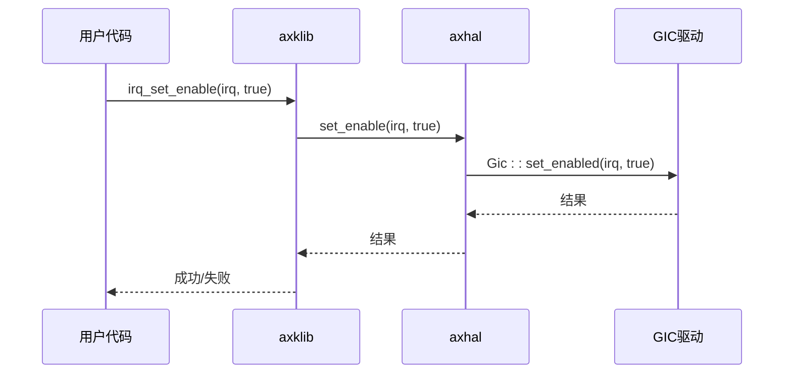
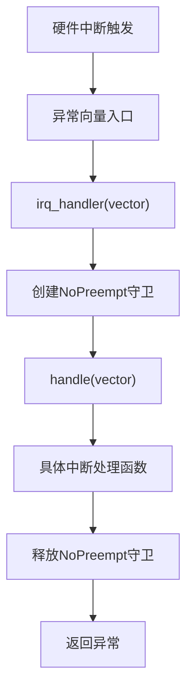

# 中断控制器驱动

<cite>
**本文档引用的文件**
- [gicv2.rs](file://modules/axdriver/src/dyn_drivers/intc/gicv2.rs)
- [gicv3.rs](file://modules/axdriver/src/dyn_drivers/intc/gicv3.rs)
- [irq.rs](file://modules/axhal/src/irq.rs)
- [lib.rs](file://modules/axklib-impl/src/lib.rs)
- [lib.rs](file://api/axklib/src/lib.rs)
- [mod.rs](file://modules/axdriver/src/dyn_drivers/intc/mod.rs)
</cite>

## 目录
1. [引言](#引言)
2. [中断控制器初始化流程](#中断控制器初始化流程)
3. [GICv2与GICv3架构差异分析](#gicv2与gicv3架构差异分析)
4. [中断号分配与优先级管理](#中断号分配与优先级管理)
5. [中断使能与屏蔽机制](#中断使能与屏蔽机制)
6. [中断处理程序注册与分发](#中断处理程序注册与分发)
7. [EOI（中断结束）写回机制](#eoi中断结束写回机制)
8. [axhal模块中的IRQ上下文处理](#axhal模块中的irq上下文处理)
9. [中断嵌套与共享中断线支持](#中断嵌套与共享中断线支持)
10. [高级特性使用指南](#高级特性使用指南)

## 引言
本文档深入解析基于ARM架构的GICv2和GICv3中断控制器在ArceOS系统中的实现机制。重点阐述中断控制器的探测与初始化、中断向量的注册与分发、中断优先级调度以及中断上下文切换等核心流程。结合axhal硬件抽象层的中断管理接口，全面揭示从硬件中断触发到软件中断服务例程执行的完整路径。

## 中断控制器初始化流程
中断控制器的初始化由动态驱动框架在内核启动早期阶段完成，通过设备树匹配特定兼容性字符串来识别并加载对应的中断控制器驱动。

**Diagram sources**
- [gicv2.rs](file://modules/axdriver/src/dyn_drivers/intc/gicv2.rs#L15-L60)
- [gicv3.rs](file://modules/axdriver/src/dyn_drivers/intc/gicv3.rs#L15-L43)

**Section sources**
- [gicv2.rs](file://modules/axdriver/src/dyn_drivers/intc/gicv2.rs#L1-L60)
- [gicv3.rs](file://modules/axdriver/src/dyn_drivers/intc/gicv3.rs#L1-L43)
- [mod.rs](file://modules/axdriver/src/dyn_drivers/intc/mod.rs#L1-L3)

## GICv2与GICv3架构差异分析
GICv2与GICv3在寄存器布局和功能特性上存在显著差异，系统通过不同的驱动模块分别支持。

### 架构对比表
| 特性 | GICv2 | GICv3 |
|------|-------|-------|
| 兼容性字符串 | "arm,cortex-a15-gic", "arm,gic-400" | "arm,gic-v3" |
| 分发器寄存器(GICD) | 支持 | 支持 |
| CPU接口寄存器(GICC) | 支持 | 不直接暴露 |
| 重分布器寄存器(GICR) | 不支持 | 支持 |
| 虚拟化扩展(HYP) | 可选(GICH/GICV) | 原生支持 |
| 初始化参数 | GICD, GICC, HyperAddress(可选) | GICD, GICR |

**Section sources**
- [gicv2.rs](file://modules/axdriver/src/dyn_drivers/intc/gicv2.rs#L15-L60)
- [gicv3.rs](file://modules/axdriver/src/dyn_drivers/intc/gicv3.rs#L15-L43)

## 中断号分配与优先级管理
中断号（IRQ Number）由设备树中指定的中断属性决定，系统通过GIC驱动进行统一管理。每个中断源被分配唯一的中断号，并关联相应的优先级值。

**Diagram sources**
- [gicv2.rs](file://modules/axdriver/src/dyn_drivers/intc/gicv2.rs#L45-L60)
- [gicv3.rs](file://modules/axdriver/src/dyn_drivers/intc/gicv3.rs#L35-L43)

## 中断使能与屏蔽机制
中断的使能与屏蔽通过调用`axhal::irq::set_enable`接口实现，该操作最终由底层GIC驱动修改对应中断的使能位。

**Diagram sources**
- [lib.rs](file://modules/axklib-impl/src/lib.rs#L30-L70)
- [irq.rs](file://modules/axhal/src/irq.rs#L5-L7)

## 中断处理程序注册与分发
中断处理程序的注册通过`axhal::irq::register`接口完成，系统建立中断号到处理函数的映射关系。

### 注册流程
1. 调用`axhal::irq::register`传入中断号和处理函数
2. 平台层将处理函数注册到中断向量表
3. 当对应中断触发时，CPU跳转至通用中断入口
4. 执行`irq_handler`进行上下文保护
5. 调用`handle(vector)`分发到具体处理程序

**Diagram sources**
- [irq.rs](file://modules/axhal/src/irq.rs#L15-L23)
- [lib.rs](file://modules/axklib-impl/src/lib.rs#L30-L70)

**Section sources**
- [irq.rs](file://modules/axhal/src/irq.rs#L1-L23)

## EOI（中断结束）写回机制
EOI（End of Interrupt）操作是GIC中断处理的关键步骤，用于通知中断控制器当前中断处理已完成，允许更高优先级中断进入。

- **GICv2**: 向GICC_EOIR寄存器写入中断号
- **GICv3**: 向GICR_EOIR0寄存器写入中断号

此操作通常由底层GIC驱动库自动完成，在中断服务例程返回后由硬件抽象层触发。

## axhal模块中的IRQ上下文处理
axhal模块提供了一套完整的中断上下文管理机制，确保中断处理的安全性和实时性。

### 上下文保护机制
- 使用`kernel_guard::NoPreempt`防止中断嵌套导致的竞态
- 在中断处理期间禁用抢占，避免任务切换
- 处理完成后释放守卫，允许重新调度

### 软中断协作模式
虽然当前代码未显式展示软中断机制，但`NoPreempt`守卫的设计为延迟处理提供了基础：
- 硬中断处理尽可能简短，仅做必要响应
- 耗时操作可通过任务调度在进程上下文中完成
- 定时器中断(`TIMER_IRQ`)和核间中断(IPI)已注册处理函数

**Section sources**
- [irq.rs](file://modules/axhal/src/irq.rs#L15-L23)
- [lib.rs](file://modules/axklib-impl/src/lib.rs#L30-L70)

## 中断嵌套与共享中断线支持
系统通过以下机制支持高级中断特性：

### 中断嵌套
- 默认情况下，`NoPreempt`守卫会阻塞同CPU上的中断抢占
- 如需支持嵌套，需在关键区外临时启用中断
- 高优先级中断可打断低优先级中断处理

### 共享中断线
- 多