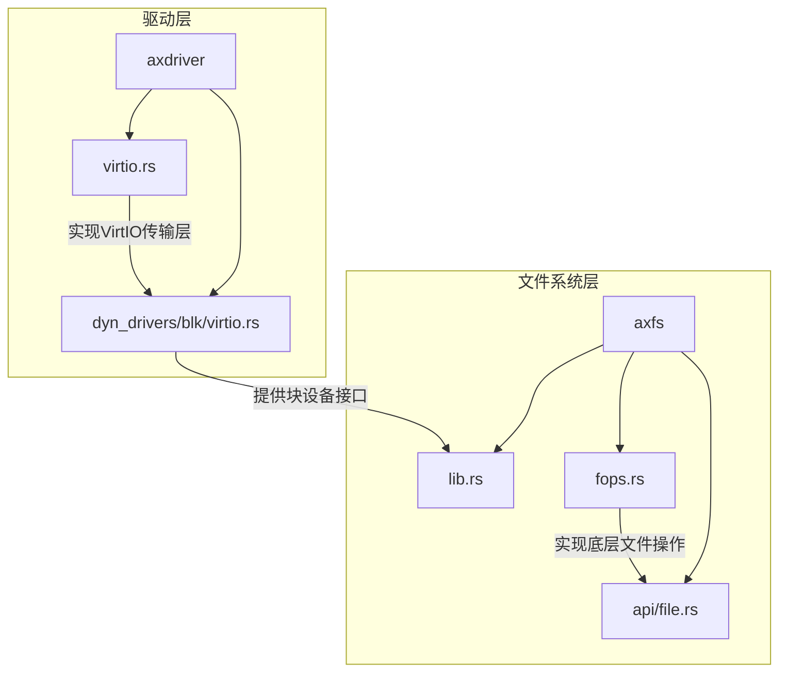
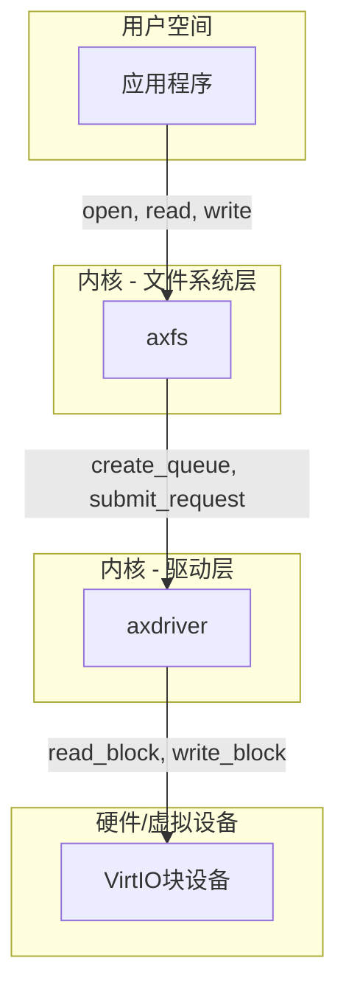
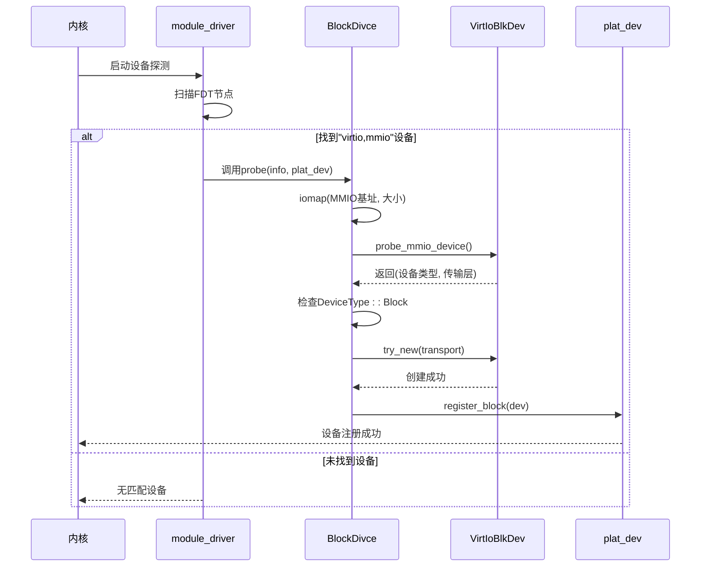
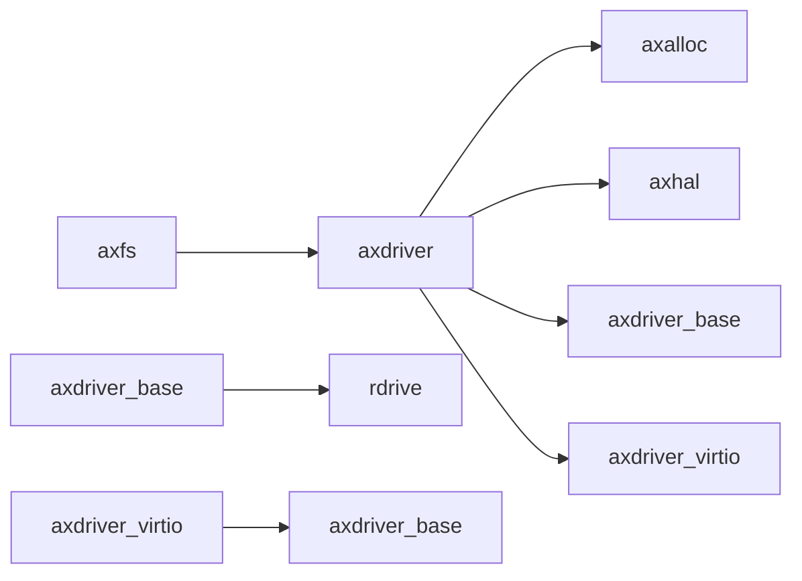

# 块设备驱动

<cite>
**本文档引用的文件**  
- [virtio.rs](file://modules/axdriver/src/dyn_drivers/blk/virtio.rs)
- [virtio.rs](file://modules/axdriver/src/virtio.rs)
- [lib.rs](file://modules/axfs/src/lib.rs)
- [fops.rs](file://modules/axfs/src/fops.rs)
- [file.rs](file://modules/axfs/src/api/file.rs)
</cite>

## 目录
1. [引言](#引言)
2. [项目结构](#项目结构)
3. [核心组件](#核心组件)
4. [架构概述](#架构概述)
5. [详细组件分析](#详细组件分析)
6. [依赖分析](#依赖分析)
7. [性能考虑](#性能考虑)
8. [故障排除指南](#故障排除指南)
9. [结论](#结论)

## 引言
本文档旨在全面解析 ArceOS 操作系统中 VirtIO 块设备驱动的技术实现。重点涵盖 virtio-blk 协议的数据结构定义、描述符链组织方式及 I/O 请求响应流程。文档将说明块设备的初始化过程、队列配置、DMA 缓冲区管理以及 I/O 完成通知机制。结合 axfs 文件系统的读写路径，展示从高层文件操作到底层块设备命令发送的完整数据流。同时讨论多队列支持、I/O 合并优化及错误恢复策略。

## 项目结构
ArceOS 的模块化设计将 VirtIO 块设备驱动分散在多个关键目录中。`axdriver` 模块负责硬件抽象和设备探测，而 `axfs` 模块则提供统一的文件系统接口。这种分层架构确保了设备驱动与上层文件系统逻辑的解耦。



**Diagram sources**
- [dyn_drivers/blk/virtio.rs](file://modules/axdriver/src/dyn_drivers/blk/virtio.rs#L0-L179)
- [virtio.rs](file://modules/axdriver/src/virtio.rs#L0-L171)
- [lib.rs](file://modules/axfs/src/lib.rs#L0-L46)
- [fops.rs](file://modules/axfs/src/fops.rs#L0-L418)
- [file.rs](file://modules/axfs/src/api/file.rs#L0-L193)

**Section sources**
- [dyn_drivers/blk/virtio.rs](file://modules/axdriver/src/dyn_drivers/blk/virtio.rs#L0-L179)
- [virtio.rs](file://modules/axdriver/src/virtio.rs#L0-L171)
- [lib.rs](file://modules/axfs/src/lib.rs#L0-L46)

## 核心组件
本节深入分析 VirtIO 块设备驱动的核心组件。`BlockDivce` 结构体是驱动对外暴露的主要实体，它封装了实际的 `VirtIoBlkDev` 设备实例，并实现了 `rdif_block::Interface` 接口以供上层调用。`BlockQueue` 则代表一个独立的请求队列，负责具体的 I/O 操作提交。`VirtIoHalImpl` 提供了内存分配、DMA 映射等底层硬件抽象服务，是驱动与操作系统内存管理子系统交互的桥梁。

**Section sources**
- [dyn_drivers/blk/virtio.rs](file://modules/axdriver/src/dyn_drivers/blk/virtio.rs#L0-L179)
- [virtio.rs](file://modules/axdriver/src/virtio.rs#L0-L171)

## 架构概述
ArceOS 的 VirtIO 块设备驱动采用分层架构，清晰地分离了协议处理、硬件抽象和设备管理。上层 `axfs` 文件系统通过标准 API 发起文件读写请求，这些请求最终被转换为对 `rdif_block::Interface` 的调用。`axdriver` 模块中的 `BlockDivce` 负责接收这些请求，并通过其内部的 `BlockQueue` 将其转化为符合 virtio-blk 规范的底层命令，利用 `VirtIoHalImpl` 进行 DMA 操作后，通过 MMIO 或 PCI 总线发送给虚拟设备。



**Diagram sources**
- [dyn_drivers/blk/virtio.rs](file://modules/axdriver/src/dyn_drivers/blk/virtio.rs#L0-L179)
- [lib.rs](file://modules/axfs/src/lib.rs#L0-L46)

## 详细组件分析
### VirtIO块设备初始化分析
当内核启动时，`module_driver!` 宏注册的探测函数会扫描设备树（FDT），寻找兼容性字符串为 `"virtio,mmio"` 的节点。一旦发现匹配的设备，`probe` 函数将被调用。该函数首先通过 `iomap` 获取设备的 MMIO 内存区域，然后调用 `axdriver_virtio::probe_mmio_device` 来识别设备类型。确认为块设备后，创建 `VirtIoBlkDev` 实例并将其包装在 `BlockDivce` 中，最后通过平台设备注册机制向系统宣告新设备的可用性。

#### 初始化序列图


**Diagram sources**
- [dyn_drivers/blk/virtio.rs](file://modules/axdriver/src/dyn_drivers/blk/virtio.rs#L0-L179)

**Section sources**
- [dyn_drivers/blk/virtio.rs](file://modules/axdriver/src/dyn_drivers/blk/virtio.rs#L0-L179)

### 数据流分析：从文件读取到块设备命令
此部分分析从用户程序调用 `File::read()` 到 VirtIO 设备执行物理读取的完整数据流。`axfs` 模块将高层文件操作转换为对块设备的扇区级访问，`axdriver` 模块则负责将这些访问打包成 virtio 协议规定的格式。

#### 文件读取流程图
```mermaid
flowchart TD
Start([应用程序: File::read]) --> AXFS_API["axfs/api/file.rs\nRead for File"]
AXFS_API --> FOPS["axfs/fops.rs\nFile::read()"]
FOPS --> VFS["调用VFS节点 read_at"]
VFS --> BLOCK_IFACE["rdif_block::Interface\nsubmit_request(Read)"]
BLOCK_IFACE --> BLOCK_QUEUE["BlockQueue::submit_request"]
BLOCK_QUEUE --> VIRTIO_DEV["raw.read_block(id, buffer)"]
VIRTIO_DEV --> HAL["VirtIoHalImpl::share\n(DMA映射)"]
HAL --> DEVICE["VirtIoBlkDev\n发送描述符链"]
DEVICE --> HW[(物理/VirtIO 硬件)]
HW -- 中断或轮询 --> DEVICE: 完成通知
DEVICE -- DMA缓冲区已填充 --> APP: 数据现在可用
```

**Diagram sources**
- [file.rs](file://modules/axfs/src/api/file.rs#L0-L193)
- [fops.rs](file://modules/axfs/src/fops.rs#L0-L418)
- [dyn_drivers/blk/virtio.rs](file://modules/axdriver/src/dyn_drivers/blk/virtio.rs#L0-L179)

**Section sources**
- [file.rs](file://modules/axfs/src/api/file.rs#L0-L193)
- [fops.rs](file://modules/axfs/src/fops.rs#L0-L418)
- [dyn_drivers/blk/virtio.rs](file://modules/axdriver/src/dyn_drivers/blk/virtio.rs#L0-L179)

## 依赖分析
VirtIO 块设备驱动的正常运行依赖于多个核心模块的协同工作。`axalloc` 模块提供页级别的内存分配，这是 `VirtIoHalImpl` 实现 `dma_alloc` 的基础。`axhal` 模块负责物理地址到虚拟地址的转换，对于 MMIO 访问至关重要。`axfs` 模块作为上层消费者，依赖于 `axdriver` 提供的稳定块设备接口来挂载和操作文件系统。



**Diagram sources**
- [virtio.rs](file://modules/axdriver/src/virtio.rs#L0-L171)
- [lib.rs](file://modules/axfs/src/lib.rs#L0-L46)

**Section sources**
- [virtio.rs](file://modules/axdriver/src/virtio.rs#L0-L171)
- [lib.rs](file://modules/axfs/src/lib.rs#L0-L46)

## 性能考虑
当前实现中，`poll_request` 方法为空实现，表明驱动可能依赖中断或简单的轮询机制来检查 I/O 完成状态，这在高吞吐量场景下可能成为瓶颈。`submit_request` 方法直接同步执行读写操作，缺乏对 I/O 请求的合并（I/O merging）或批处理优化，可能导致大量的小型、低效的磁盘访问。此外，单队列的设计限制了多核 CPU 的并行处理能力。未来的优化方向应包括实现异步非阻塞 I/O、引入请求队列进行合并、并探索多队列（multiqueue）支持以提升并发性能。

## 故障排除指南
常见的故障点通常出现在设备初始化阶段。如果系统日志中出现 `[...] has no reg` 错误，表明设备树中缺少正确的 MMIO 地址寄存器定义。`failed to initialize Virtio Block device` 错误则可能源于 `global_allocator().alloc_pages` 分配失败，需检查系统内存状况。在 `submit_request` 中发生的错误会被 `maping_dev_err_to_blk_err` 函数转换，开发者应关注此函数的实现以理解底层 VirtIO 错误码到块设备错误码的映射关系。

**Section sources**
- [dyn_drivers/blk/virtio.rs](file://modules/axdriver/src/dyn_drivers/blk/virtio.rs#L0-L179)

## 结论
本文档详细剖析了 ArceOS 中 VirtIO 块设备驱动的实现。驱动通过清晰的分层设计，成功地将 virtio-blk 协议的复杂性封装起来，为上层文件系统提供了简洁可靠的块设备接口。从设备探测、初始化到 I/O 请求的完整数据流都得到了阐述。尽管当前实现功能完备，但在性能优化方面仍有显著提升空间，特别是引入异步 I/O 和多队列支持将是未来增强系统整体 I/O 性能的关键步骤。