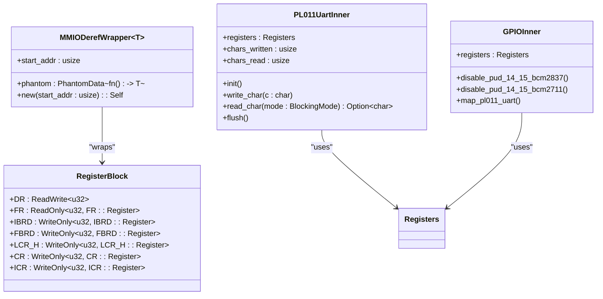
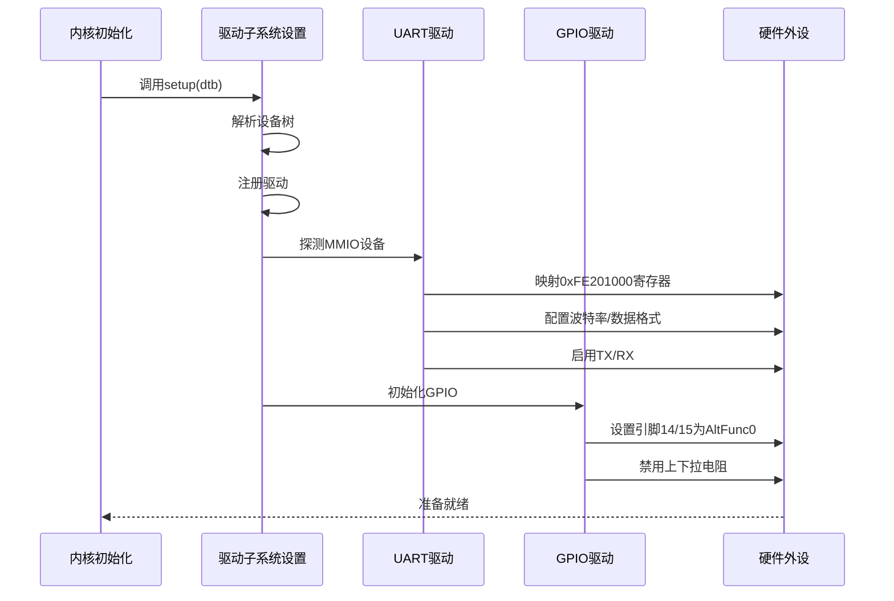

# MMIO总线支持

<cite>
**本文档中引用的文件**
- [mmio.rs](file://modules/axdriver/src/bus/mmio.rs)
- [mod.rs](file://modules/axdriver/src/dyn_drivers/mod.rs)
- [common.rs](file://tools/raspi4/chainloader/src/bsp/device_driver/common.rs)
- [bcm2xxx_pl011_uart.rs](file://tools/raspi4/chainloader/src/bsp/device_driver/bcm/bcm2xxx_pl011_uart.rs)
- [bcm2xxx_gpio.rs](file://tools/raspi4/chainloader/src/bsp/device_driver/bcm/bcm2xxx_gpio.rs)
- [lib.rs](file://modules/axmm/src/lib.rs)
- [platform_raspi4.md](file://doc/platform_raspi4.md)
</cite>

## 目录
1. [引言](#引言)
2. [MMIO地址映射机制](#mmio地址映射机制)
3. [寄存器访问方式与内存屏障](#寄存器访问方式与内存屏障)
4. [axdriver框架中的安全读写实现](#axdriver框架中的安全读写实现)
5. [树莓派4平台实例分析](#树莓派4平台实例分析)
6. [飞腾平台适配说明](#飞腾平台适配说明)
7. [静态设备模型注册流程](#静态设备模型注册流程)
8. [BSP层交互逻辑](#bsp层交互逻辑)
9. [新MMIO设备驱动开发最佳实践](#新mmio设备驱动开发最佳实践)
10. [结论](#结论)

## 引言
ArceOS通过axdriver框架实现了对内存映射I/O（MMIO）总线的全面支持，为嵌入式系统和操作系统内核提供了高效、安全的硬件设备访问能力。该机制允许内核直接通过虚拟内存地址访问外设寄存器，广泛应用于UART、GPIO等控制器的操作。本文档深入解析MMIO总线在Arceos中的实现原理，结合树莓派4和飞腾平台的实际案例，阐述其核心组件的工作机制，并提供开发新MMIO驱动的最佳实践指导。

## MMIO地址映射机制
MMIO地址映射是将物理设备寄存器地址转换为内核可访问的虚拟地址的过程。在ArceOS中，这一过程由`axmm::iomap`函数完成，它负责将指定的物理地址范围映射到内核地址空间中，并设置适当的页表属性以确保设备内存的正确访问。

映射过程中会检查目标区域是否已存在映射，若已存在则直接返回对应的虚拟地址；否则创建新的线性映射，并应用包含DEVICE、READ和WRITE标志的内存映射属性。这种设计保证了设备内存区域不会被缓存，从而避免因缓存一致性问题导致的数据错误。

**Section sources**
- [lib.rs](file://modules/axmm/src/lib.rs#L87-L129)
- [mod.rs](file://modules/axdriver/src/dyn_drivers/mod.rs#L38-L46)

## 寄存器访问方式与内存屏障
在MMIO操作中，寄存器的读写必须严格按照预期顺序执行，不能被编译器或处理器重排序。为此，ArceOS采用Rust的volatile读写原语来访问设备寄存器，确保每次访问都会生成实际的内存操作指令。

此外，在关键操作点插入内存屏障（memory barrier）可以防止不希望的指令重排。例如，在配置完一组寄存器后启动设备前，需要插入写屏障以确保所有配置已生效；在轮询状态寄存器时，则需使用读屏障保证每次都从硬件获取最新值。

虽然当前代码未显式调用内存屏障指令，但底层硬件抽象层（HAL）和体系结构相关的汇编代码会根据需要自动插入适当的屏障，保障跨CPU核心和外设之间的内存可见性。

**Section sources**
- [bcm2xxx_pl011_uart.rs](file://tools/raspi4/chainloader/src/bsp/device_driver/bcm/bcm2xxx_pl011_uart.rs#L0-L402)
- [bcm2xxx_gpio.rs](file://tools/raspi4/chainloader/src/bsp/device_driver/bcm/bcm2xxx_gpio.rs#L0-L228)

## axdriver框架中的安全读写实现
axdriver框架通过封装低级MMIO操作，提供了一套类型安全且易于使用的API来访问设备特定的内存区域。核心机制是`MMIODerefWrapper<T>`结构体，它利用Rust的Deref trait将裸指针包装成对特定寄存器结构体的安全引用。

该包装器在构造时接受设备寄存器块的起始物理地址，并通过`phys_to_virt`将其转换为虚拟地址。当用户通过解引用操作访问寄存器时，框架会自动生成正确的偏移量并执行非缓存的内存访问，有效防止了越界和类型混淆等常见错误。

同时，配合NullLock等同步原语，框架还支持多线程环境下的并发访问控制，确保同一设备不会被多个上下文同时修改。



**Diagram sources**
- [common.rs](file://tools/raspi4/chainloader/src/bsp/device_driver/common.rs#L0-L37)
- [bcm2xxx_pl011_uart.rs](file://tools/raspi4/chainloader/src/bsp/device_driver/bcm/bcm2xxx_pl011_uart.rs#L0-L402)
- [bcm2xxx_gpio.rs](file://tools/raspi4/chainloader/src/bsp/device_driver/bcm/bcm2xxx_gpio.rs#L0-L228)

**Section sources**
- [common.rs](file://tools/raspi4/chainloader/src/bsp/device_driver/common.rs#L0-L37)
- [bcm2xxx_pl011_uart.rs](file://tools/raspi4/chainloader/src/bsp/device_driver/bcm/bcm2xxx_pl011_uart.rs#L0-L402)
- [bcm2xxx_gpio.rs](file://tools/raspi4/chainloader/src/bsp/device_driver/bcm/bcm2xxx_gpio.rs#L0-L228)

## 树莓派4平台实例分析
在树莓派4平台上，ArceOS通过axdriver框架实现了对BCM2711 SoC中PL011 UART和GPIO控制器的完整支持。具体实现位于BSP（Board Support Package）层的相关模块中。

对于UART控制器，驱动程序首先初始化波特率寄存器（IBRD/FBRD），设置数据格式为8N1，并启用FIFO模式。随后通过控制寄存器（CR）开启接收和发送功能。整个初始化过程严格遵循ARM PrimeCell UART技术参考手册的要求。

GPIO驱动则负责将特定引脚（如14和15）配置为UART功能，并禁用内部上下拉电阻。由于不同版本的树莓派使用不同的寄存器布局（BCM2837 vs BCM2711），驱动通过条件编译分别处理两种情况，体现了良好的平台兼容性设计。



**Diagram sources**
- [bcm2xxx_pl011_uart.rs](file://tools/raspi4/chainloader/src/bsp/device_driver/bcm/bcm2xxx_pl011_uart.rs#L0-L402)
- [bcm2xxx_gpio.rs](file://tools/raspi4/chainloader/src/bsp/device_driver/bcm/bcm2xxx_gpio.rs#L0-L228)
- [platform_raspi4.md](file://doc/platform_raspi4.md#L0-L28)

**Section sources**
- [bcm2xxx_pl011_uart.rs](file://tools/raspi4/chainloader/src/bsp/device_driver/bcm/bcm2xxx_pl011_uart.rs#L0-L402)
- [bcm2xxx_gpio.rs](file://tools/raspi4/chainloader/src/bsp/device_driver/bcm/bcm2xxx_gpio.rs#L0-L228)
- [platform_raspi4.md](file://doc/platform_raspi4.md#L0-L28)

## 飞腾平台适配说明
尽管当前代码库主要展示了树莓派4的实现细节，但ArceOS的设计原则同样适用于飞腾（Phytium）等国产处理器平台。飞腾平台通常基于ARM64架构，因此大部分MMIO机制可以直接复用。

适配工作主要集中在BSP层，包括：
1. 定义正确的设备寄存器物理地址
2. 实现平台特有的中断控制器接口
3. 配置时钟和电源管理单元
4. 处理平台特定的启动流程和调试接口

文档`platform_phytium_pi.md`的存在表明项目已规划对飞腾平台的支持，开发者可参照现有树莓派实现模式进行移植。

**Section sources**
- [platform_phytium_pi.md](file://doc/platform_phytium_pi.md)

## 静态设备模型注册流程
ArceOS采用静态设备模型来管理MMIO设备的生命周期。设备驱动在编译时通过链接器符号段（`__sdriver_register`到`__edriver_register`）自动注册到全局驱动列表中。

系统启动时，`dyn_drivers::setup`函数会被调用，它首先解析设备树（DTB）获取硬件资源配置信息，然后遍历所有已注册的驱动并尝试匹配相应的设备节点。对于VIRTIO_MMIO类型的设备，还会根据预定义的地址范围逐一探测。

一旦驱动成功探测到设备，就会创建对应的设备实例并加入`AllDevices`集合，供后续的设备管理和调度使用。

```mermaid
flowchart TD
    Start([系统启动]) --> ParseDTB["解析设备树(DTB)"]
    ParseDTB --> CheckDTB{"DTB地址有效?"}
    CheckDTB -->|否| Skip["跳过驱动初始化"]
    CheckDTB -->|是| InitDMA["初始化DMA API"]
    InitDMA --> RegisterDrivers["注册驱动到rdrive"]
    RegisterDrivers --> ProbeDevices