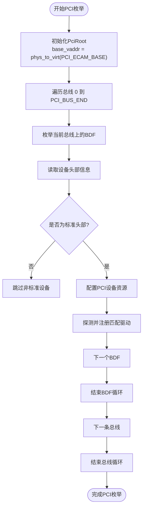
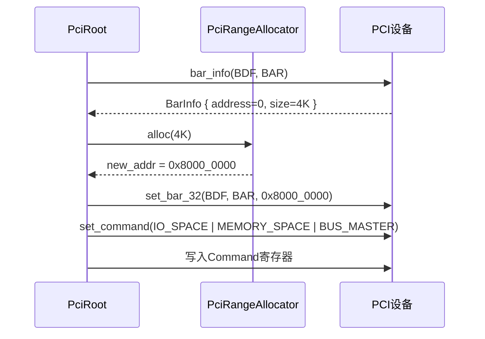
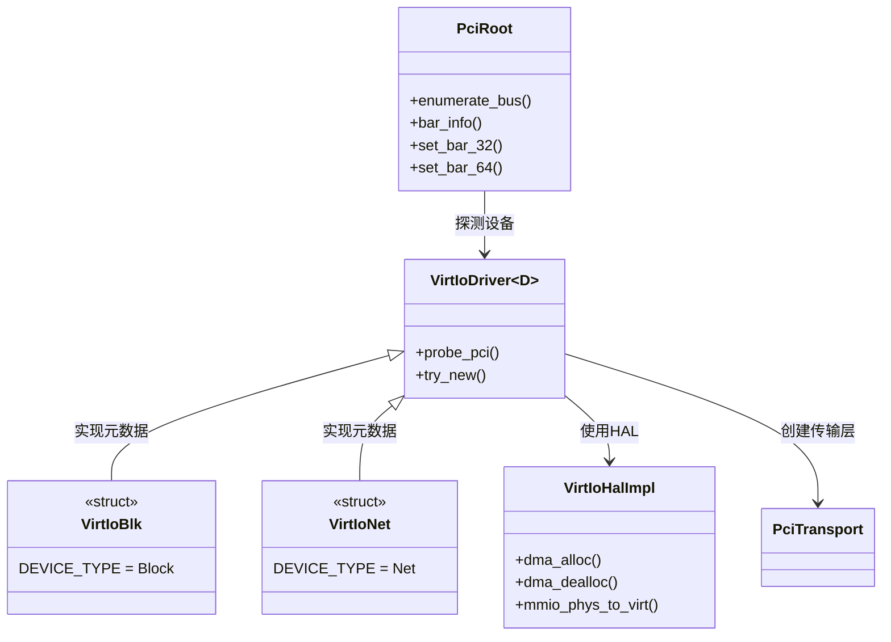
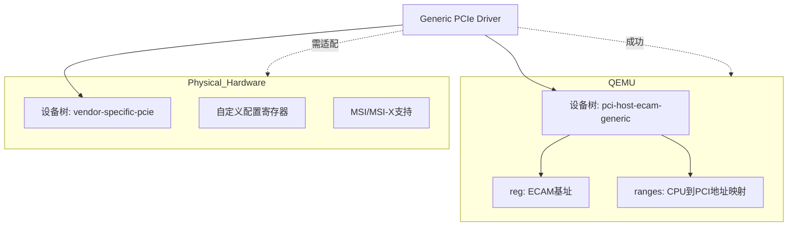

# PCI总线支持

<cite>
**本文档引用的文件**
- [pci.rs](file://modules/axdriver/src/bus/pci.rs)
- [pci.rs](file://modules/axdriver/src/dyn_drivers/pci.rs)
- [virtio.rs](file://modules/axdriver/src/virtio.rs)
- [virtio.rs](file://modules/axdriver/src/dyn_drivers/blk/virtio.rs)
</cite>

## 目录
1. [引言](#引言)
2. [PCI设备枚举机制](#pci设备枚举机制)
3. [配置空间访问与BAR资源分配](#配置空间访问与bar资源分配)
4. [PCI设备探测与初始化流程](#pci设备探测与初始化流程)
5. [VirtIO驱动集成与调用关系](#virtio驱动集成与调用关系)
6. [QEMU与物理硬件差异分析](#qemu与物理硬件差异分析)
7. [常见问题排查指南](#常见问题排查指南)
8. [结论](#结论)

## 引言
arceos操作系统通过axdriver框架实现了对PCI总线的完整支持，涵盖设备枚举、资源配置、驱动加载等核心功能。本技术文档深入解析其PCI子系统的设计与实现，重点阐述设备发现机制、内存映射I/O（MMIO）和端口I/O（PIO）资源分配策略，并结合代码逻辑说明如何通过ECAM（Enhanced Configuration Access Mechanism）方式访问PCI配置空间。同时，文档将展示VirtIO虚拟设备在该架构下的集成方式，并提供实际部署中的故障诊断方法。

**Section sources**
- [pci.rs](file://modules/axdriver/src/bus/pci.rs#L0-L122)

## PCI设备枚举机制
arceos采用基于ECAM的PCI设备枚举方案。系统启动时，`AllDevices::probe_bus_devices`函数会初始化一个`PciRoot`实例，指向由平台配置定义的PCI ECAM基地址（`PCI_ECAM_BASE`），并通过`enumerate_bus`遍历所有总线号（从0到`PCI_BUS_END`）。对于每个总线上的设备函数（BDF：Bus, Device, Function），读取其设备信息结构体`DeviceFunctionInfo`，仅处理标准头部类型（HeaderType::Standard）的设备。

枚举过程中，系统通过配置空间读取设备的基本属性，包括厂商ID（vendor ID）、设备ID（device ID）以及头部信息，为后续的资源分配和驱动匹配做准备。



**Diagram sources**
- [pci.rs](file://modules/axdriver/src/bus/pci.rs#L94-L121)

**Section sources**
- [pci.rs](file://modules/axdriver/src/bus/pci.rs#L94-L121)

## 配置空间访问与BAR资源分配
PCI设备通过基地址寄存器（BAR）声明其所需的内存或I/O资源。arceos使用`PciRoot`提供的接口访问配置空间，例如`bar_info(bdf, bar)`用于查询指定BAR的状态。若检测到内存型BAR的地址为0且大小大于0，则表明需要进行地址分配。

系统利用`PciRangeAllocator`从预定义的PCI内存范围（`PCI_RANGES`）中分配合适的物理地址，并通过`set_bar_32`或`set_bar_64`写回配置空间。分配完成后，再次读取BAR信息以验证结果，并启用设备的I/O空间、内存空间和总线主控功能（通过设置Command寄存器）。



**Diagram sources**
- [pci.rs](file://modules/axdriver/src/bus/pci.rs#L0-L92)

**Section sources**
- [pci.rs](file://modules/axdriver/src/bus/pci.rs#L0-L92)

## PCI设备探测与初始化流程
设备初始化由`config_pci_device`函数主导，该函数遍历设备的所有6个BAR寄存器。对于未分配地址的内存型BAR，调用资源分配器获取新地址并写入。初始化完成后，系统遍历所有已注册的驱动，调用其`probe_pci`方法尝试匹配设备。

此过程涉及地址解码——将设备声明的BAR地址映射到系统的物理地址空间，并确保不与其他设备冲突。中断号（IRQ）通常由平台固件（如设备树）提供，在axdriver中通过FDT（Flattened Device Tree）信息传递给驱动。

```mermaid
flowchart LR
A[开始设备初始化] --> B[遍历BAR 0-5]
B --> C{BAR为Memory类型?}
C --> |是| D{地址为0且size>0?}
D --> |是| E[调用allocator.alloc()]
E --> F[调用set_bar_XX写回]
D --> |否| G[保留原地址]
C --> |否| H[处理IO BAR或跳过]
F --> I[检查是否占用两个条目]
H --> I
I --> J[递增BAR索引]
J --> K{BAR < 6?}
K --> |否| L[启用设备命令寄存器]
K --> |是| B
L --> M[完成初始化]
```

**Diagram sources**
- [pci.rs](file://modules/axdriver/src/bus/pci.rs#L0-L92)

**Section sources**
- [pci.rs](file://modules/axdriver/src/bus/pci.rs#L0-L92)

## VirtIO驱动集成与调用关系
VirtIO设备作为PCI设备的一种特例，在arceos中通过`VirtIoDriver`统一管理。当PCI枚举发现厂商ID为0x1AF4的设备时，`probe_pci`函数会根据设备ID判断其类型（如0x1000为网络设备，0x1001为块设备），并调用`axdriver_virtio::probe_pci_device`进一步探测。

一旦确认为VirtIO设备，系统将创建相应的传输层实例（`PciTransport`），并构造具体设备对象（如`VirtIoBlkDev`）。该机制通过`cfg_if!`宏实现编译期配置，支持不同类型的VirtIO设备（网络、块、显示）动态注册。



**Diagram sources**
- [virtio.rs](file://modules/axdriver/src/virtio.rs#L0-L171)
- [pci.rs](file://modules/axdriver/src/bus/pci.rs#L94-L121)

**Section sources**
- [virtio.rs](file://modules/axdriver/src/virtio.rs#L0-L171)

## QEMU与物理硬件差异分析
在QEMU模拟环境下，PCI控制器通常以“pci-host-ecam-generic”兼容性字符串出现在设备树中。arceos的`Generic PCIe Controller Driver`通过FDT探测机制加载，解析`reg`和`ranges`属性以确定ECAM基址和内存映射范围。

而在物理硬件上，PCI资源布局可能更加复杂，需依赖具体的SoC设计。例如，某些平台可能使用非标准的ECAM偏移或分段总线结构。此外，物理设备的中断路由（如MSI/MSI-X）配置也可能与QEMU默认行为不同，需要额外的平台适配代码。



**Diagram sources**
- [pci.rs](file://modules/axdriver/src/dyn_drivers/pci.rs#L0-L71)

**Section sources**
- [pci.rs](file://modules/axdriver/src/dyn_drivers/pci.rs#L0-L71)

## 常见问题排查指南
### 设备未识别
- **现象**：日志中无PCI设备输出或特定设备缺失。
- **排查步骤**：
  1. 检查`PCI_ECAM_BASE`和`PCI_BUS_END`配置是否正确。
  2. 确认设备树中PCI节点的`compatible`属性为`pci-host-ecam-generic`。
  3. 使用调试日志确认`enumerate_bus`是否执行及返回空列表的原因。

### 资源冲突
- **现象**：BAR分配失败或设备无法访问。
- **解决方案**：
  1. 检查`PCI_RANGES`配置，确保有足够的连续内存可供分配。
  2. 验证分配的地址未与内核映像或其他设备重叠。
  3. 启用详细日志查看BAR的实际分配情况。

### VirtIO设备初始化失败
- **可能原因**：
  - MMIO区域映射失败（`iomap`调用出错）。
  - VirtIO协商失败（特征位不匹配）。
- **建议**：
  - 确保QEMU命令行正确传递VirtIO设备（如`-device virtio-blk-pci`）。
  - 检查`virtio.rs`中`DEVICE_TYPE`与`device_id`的对应关系。

**Section sources**
- [pci.rs](file://modules/axdriver/src/bus/pci.rs#L0-L122)
- [virtio.rs](file://modules/axdriver/src/virtio.rs#L0-L171)

## 结论
arceos通过模块化设计实现了