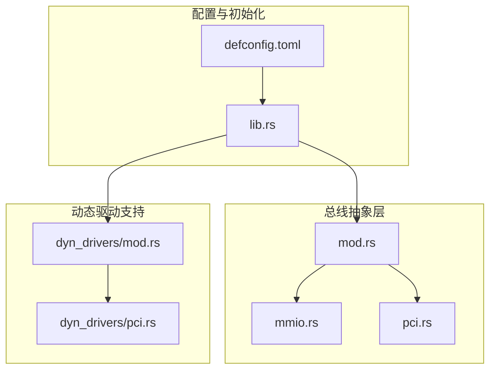
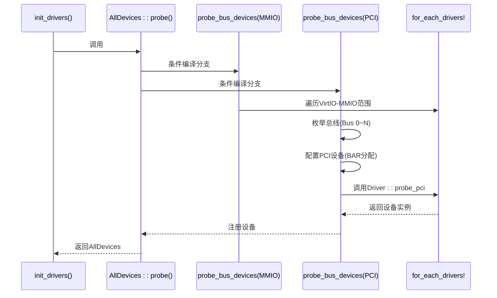
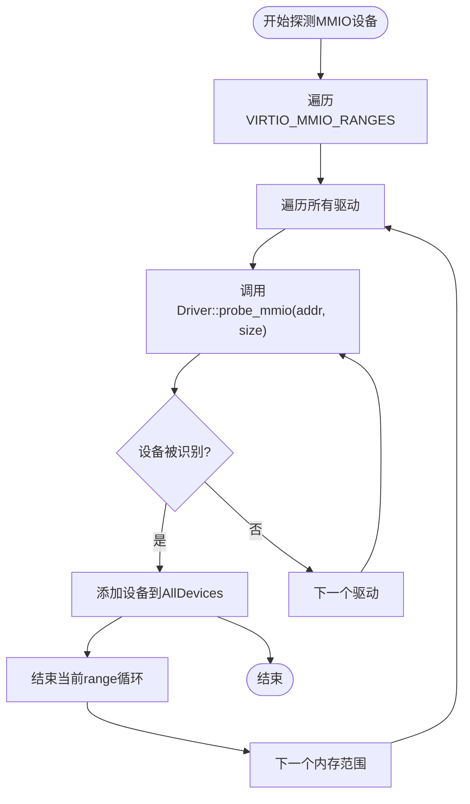
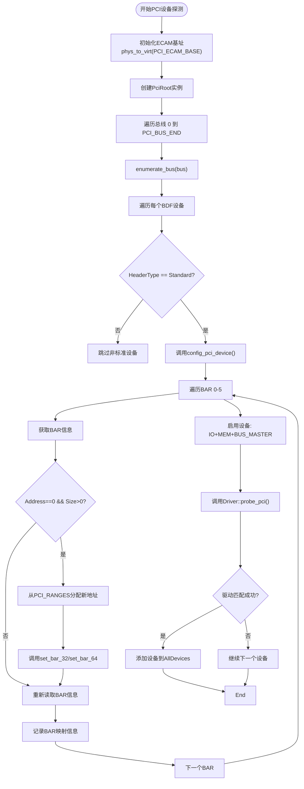
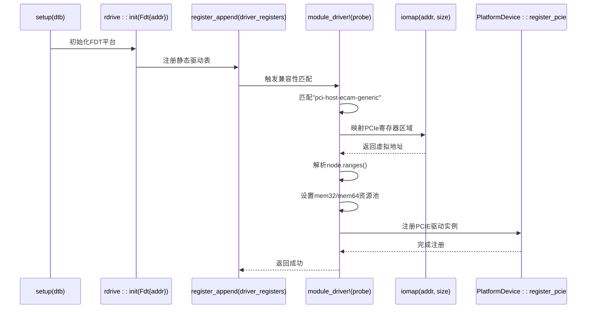
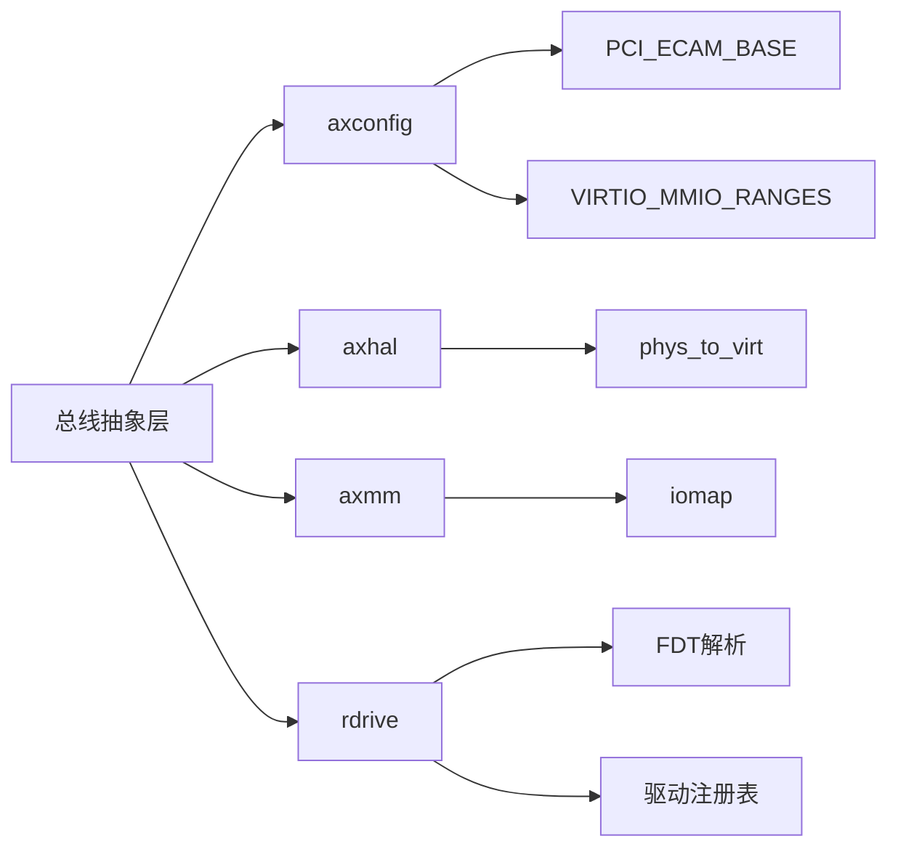

# 总线抽象层

<cite>
**本文档引用的文件**
- [mod.rs](file://modules/axdriver/src/bus/mod.rs)
- [mmio.rs](file://modules/axdriver/src/bus/mmio.rs)
- [pci.rs](file://modules/axdriver/src/bus/pci.rs)
- [lib.rs](file://modules/axdriver/src/lib.rs)
- [defconfig.toml](file://configs/defconfig.toml)
- [dyn_drivers/mod.rs](file://modules/axdriver/src/dyn_drivers/mod.rs)
- [dyn_drivers/pci.rs](file://modules/axdriver/src/dyn_drivers/pci.rs)
</cite>

## 目录
1. [引言](#引言)
2. [项目结构](#项目结构)
3. [核心组件](#核心组件)
4. [架构概述](#架构概述)
5. [详细组件分析](#详细组件分析)
6. [依赖分析](#依赖分析)
7. [性能考虑](#性能考虑)
8. [故障排除指南](#故障排除指南)
9. [结论](#结论)

## 引言
本文档旨在深入解析 ArceOS 操作系统中总线抽象层的设计与实现，重点阐述 PCI 和 MMIO 两种总线接口的工作机制。文档将详细说明设备枚举、资源分配和地址映射的具体流程，并结合 axdriver 框架展示如何访问硬件设备。同时，分析静态绑定与动态探测的差异，并为开发者提供扩展新总线类型的指导。

## 项目结构
ArceOS 的总线抽象层主要位于 `modules/axdriver/src/bus` 目录下，包含对 MMIO 和 PCI 总线的支持。该模块通过条件编译特性（`bus-mmio` 和 `bus-pci`）控制不同总线类型的启用。配置信息由 `axconfig` 模块提供，包括设备内存范围和 ECAM 基地址等关键参数。

**图示来源**
- [mod.rs](file://modules/axdriver/src/bus/mod.rs#L1-L5)
- [mmio.rs](file://modules/axdriver/src/bus/mmio.rs#L1-L24)
- [pci.rs](file://modules/axdriver/src/bus/pci.rs#L1-L123)
- [lib.rs](file://modules/axdriver/src/lib.rs#L1-L199)
- [defconfig.toml](file://configs/defconfig.toml#L1-L7)
- [dyn_drivers/mod.rs](file://modules/axdriver/src/dyn_drivers/mod.rs#L1-L75)
- [dyn_drivers/pci.rs](file://modules/axdriver/src/dyn_drivers/pci.rs#L1-L72)

**本节来源**
- [modules/axdriver/src/bus](file://modules/axdriver/src/bus)
- [configs/defconfig.toml](file://configs/defconfig.toml#L1-L7)

## 核心组件
总线抽象层的核心功能集中在 `AllDevices::probe_bus_devices` 方法中，该方法根据编译时启用的总线类型（MMIO 或 PCI）执行相应的设备探测逻辑。对于 MMIO 设备，系统遍历预定义的 VirtIO 内存区域进行探测；而对于 PCI 设备，则通过 ECAM 机制枚举总线上的所有设备并完成资源配置。

**本节来源**
- [mmio.rs](file://modules/axdriver/src/bus/mmio.rs#L5-L23)
- [pci.rs](file://modules/axdriver/src/bus/pci.rs#L25-L122)
- [lib.rs](file://modules/axdriver/src/lib.rs#L150-L198)

## 架构概述
ArceOS 的总线抽象层采用分层设计，上层为统一的设备容器 `AllDevices`，下层为具体的总线实现（MMIO/PCI）。系统启动时，`init_drivers` 函数调用 `probe` 方法，进而触发 `probe_bus_devices` 完成总线级设备发现。整个过程涉及物理地址到虚拟地址的映射、PCI 配置空间访问以及 BAR 资源分配等关键操作。

**图示来源**
- [lib.rs](file://modules/axdriver/src/lib.rs#L150-L198)
- [mmio.rs](file://modules/axdriver/src/bus/mmio.rs#L5-L23)
- [pci.rs](file://modules/axdriver/src/bus/pci.rs#L25-L122)

## 详细组件分析

### MMIO 总线接口分析
MMIO（Memory-Mapped I/O）总线接口通过内存映射方式访问设备寄存器。在 ArceOS 中，该机制主要用于探测和初始化 VirtIO 设备。系统依据 `axconfig::devices::VIRTIO_MMIO_RANGES` 配置的内存范围，逐一尝试匹配已注册的驱动程序。

#### 实现流程

**图示来源**
- [mmio.rs](file://modules/axdriver/src/bus/mmio.rs#L5-L23)

**本节来源**
- [mmio.rs](file://modules/axdriver/src/bus/mmio.rs#L5-L23)

### PCI 总线接口分析
PCI（Peripheral Component Interconnect）总线接口采用 ECAM（Enhanced Configuration Access Mechanism）标准访问设备配置空间。ArceOS 通过 `PciRoot` 结构体管理 PCI 树状拓扑，实现设备枚举和资源配置。

#### 设备枚举与资源配置流程

**图示来源**
- [pci.rs](file://modules/axdriver/src/bus/pci.rs#L25-L122)

**本节来源**
- [pci.rs](file://modules/axdriver/src/bus/pci.rs#L25-L122)

### 动态驱动框架分析
当启用 `dyn` 特性时，ArceOS 使用基于 FDT（Flattened Device Tree）的动态驱动加载机制。此模式下，`setup` 函数接收设备树地址作为参数，通过 `rdrive` 库解析设备节点并自动匹配驱动。

#### 动态PCI控制器驱动工作流程

**图示来源**
- [dyn_drivers/mod.rs](file://modules/axdriver/src/dyn_drivers/mod.rs#L1-L75)
- [dyn_drivers/pci.rs](file://modules/axdriver/src/dyn_drivers/pci.rs#L1-L72)

**本节来源**
- [dyn_drivers/mod.rs](file://modules/axdriver/src/dyn_drivers/mod.rs#L1-L75)
- [dyn_drivers/pci.rs](file://modules/axdriver/src/dyn_drivers/pci.rs#L1-L72)

## 依赖分析
总线抽象层与其他模块存在紧密依赖关系。`axconfig` 提供编译期配置常量，`axhal` 负责物理地址转换，`axmm` 实现 I/O 内存映射，而 `rdrive` 在动态模式下承担设备树解析任务。

**图示来源**
- [lib.rs](file://modules/axdriver/src/lib.rs#L1-L199)
- [pci.rs](file://modules/axdriver/src/bus/pci.rs#L1-L123)
- [dyn_drivers/mod.rs](file://modules/axdriver/src/dyn_drivers/mod.rs#L1-L75)

**本节来源**
- [lib.rs](file://modules/axdriver/src/lib.rs#L1-L199)
- [pci.rs](file://modules/axdriver/src/bus/pci.rs#L1-L123)
- [dyn_drivers/mod.rs](file://modules/axdriver/src/dyn_drivers/mod.rs#L1-L75)

## 性能考虑
静态编译时绑定避免了动态调度开销，适合单一设备场景；而运行时动态探测虽然引入少量间接调用成本，但支持多实例和热插拔，灵活性更高。PCI 总线的 ECAM 访问具有固定延迟，而 MMIO 探测效率取决于内存范围数量和驱动匹配速度。

## 故障排除指南
常见问题包括设备未被识别、BAR 分配失败或 I/O 映射错误。应首先检查 `axconfig` 中的地址范围配置是否正确，其次确认设备树中相关节点是否存在且兼容性字符串匹配。调试日志可通过启用 `log` 特性获取详细探测过程。

**本节来源**
- [pci.rs](file://modules/axdriver/src/bus/pci.rs#L50-L60)
- [mmio.rs](file://modules/axdriver/src/bus/mmio.rs#L10-L15)
- [dyn_drivers/pci.rs](file://modules/axdriver/src/dyn_drivers/pci.rs#L30-L4