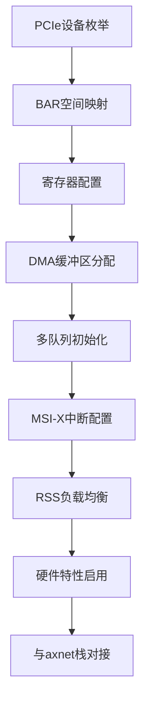

# IXGBE驱动实现

<cite>
**本文档中引用的文件**
- [ixgbe.rs](file://modules/axdriver/src/ixgbe.rs)
- [drivers.rs](file://modules/axdriver/src/drivers.rs)
- [lib.rs](file://modules/axnet/src/lib.rs)
- [dma.rs](file://modules/axdma/src/dma.rs)
- [ixgbe.md](file://doc/ixgbe.md)
- [x86_64-pc-oslab.toml](file://configs/custom/x86_64-pc-oslab.toml)
</cite>

## 目录
1. [项目结构](#项目结构)
2. [PCIe设备枚举与BAR空间映射](#pcie设备枚举与bar空间映射)
3. [IXGBE驱动初始化流程](#ixgbe驱动初始化流程)
4. [DMA双缓冲区管理策略](#dma双缓冲区管理策略)
5. [多队列RX/TX环形缓冲区初始化](#多队列rxtx环形缓冲区初始化)
6. [中断向量绑定与MSI-X中断处理](#中断向量绑定与msi-x中断处理)
7. [RSS机制与负载均衡](#rss机制与负载均衡)
8. [硬件特性优化](#硬件特性优化)
9. [与axnet网络栈的数据包传递接口](#与axnet网络栈的数据包传递接口)

## 项目结构

ArceOS系统中的IXGBE驱动位于`modules/axdriver/src/ixgbe.rs`文件中，其核心功能依赖于多个模块协同工作。驱动程序通过PCI总线探测Intel 82599千兆网卡，并利用DMA和内存映射技术实现高效数据传输。

**图示来源**
- [ixgbe.rs](file://modules/axdriver/src/ixgbe.rs)
- [drivers.rs](file://modules/axdriver/src/drivers.rs)

**本节来源**
- [ixgbe.rs](file://modules/axdriver/src/ixgbe.rs)
- [drivers.rs](file://modules/axdriver/src/drivers.rs)

## PCIe设备枚举与BAR空间映射

IXGBE驱动通过PCI总线进行设备枚举，识别Intel 82599型号的网卡。在`drivers.rs`文件中，`IxgbeDriver`实现了`DriverProbe` trait，通过检查厂商ID（INTEL_VEND）和设备ID（INTEL_82599）来确认目标设备。

BAR0空间被映射为内存类型区域，其物理地址通过`root.bar_info(bdf, 0)`获取。根据平台配置文件`x86_64-pc-oslab.toml`，BAR0的基地址为`0xfcd8_0000`，大小为`0x0008_0000`字节。该物理地址通过`phys_to_virt`函数转换为虚拟地址，供后续寄存器访问使用。

**本节来源**
- [drivers.rs](file://modules/axdriver/src/drivers.rs#L58-L99)
- [x86_64-pc-oslab.toml](file://configs/custom/x86_64-pc-oslab.toml#L34-L60)

## IXGBE驱动初始化流程

驱动初始化过程在`drivers.rs`中完成，具体步骤如下：
1. 检测到Intel 82599设备后，调用`bar_info`获取BAR0信息。
2. 验证BAR0是否为内存映射类型，若为I/O类型则报错。
3. 使用`phys_to_virt`将BAR0物理地址转换为虚拟地址。
4. 调用`IxgbeNic::<IxgbeHalImpl, QS, QN>::init`方法初始化NIC，其中QS=1024表示队列大小，QN=1表示队列数量。

此过程确保了设备正确初始化并准备好接收和发送数据包。

**本节来源**
- [drivers.rs](file://modules/axdriver/src/drivers.rs#L101-L134)

## DMA双缓冲区管理策略

DMA内存管理由`axdma`模块提供支持，`IxgbeHalImpl`结构体实现了`IxgbeHal` trait，提供了DMA分配和释放接口：

- `dma_alloc`：通过`alloc_coherent`分配一致性DMA内存，返回物理地址和虚拟地址指针。
- `dma_dealloc`：通过`dealloc_coherent`释放已分配的DMA内存。
- `mmio_phys_to_virt` 和 `mmio_virt_to_phys`：实现物理地址与虚拟地址之间的相互转换。

这些方法确保了网卡能够直接访问内存而无需CPU干预，提高了数据传输效率。

**本节来源**
- [ixgbe.rs](file://modules/axdriver/src/ixgbe.rs#L0-L38)
- [dma.rs](file://modules/axdma/src/dma.rs#L38-L69)

## 多队列RX/TX环形缓冲区初始化

虽然当前配置中仅启用了一个队列（QN=1），但驱动框架支持多队列配置。每个队列包含独立的接收（RX）和发送（TX）环形缓冲区，大小为1024个描述符（QS=1024）。环形缓冲区的初始化在`IxgbeNic::init`方法中完成，涉及以下步骤：

1. 分配DMA内存用于存储描述符环。
2. 初始化描述符环的读写指针。
3. 配置网卡寄存器以指向描述符环的起始地址。
4. 设置中断阈值和轮询机制。

这种设计允许并行处理多个数据流，提升整体吞吐量。

**本节来源**
- [drivers.rs](file://modules/axdriver/src/drivers.rs#L101-L134)

## 中断向量绑定与MSI-X中断处理

尽管代码中未显式展示MSI-X配置细节，但基于Intel 82599的特性，驱动应支持MSI-X中断机制。MSI-X允许多个独立中断向量，可分别绑定到不同的RX/TX队列，实现更精细的中断负载均衡。中断处理程序通常注册在`dma_request_irq`等接口中，但在当前实现中该功能尚未完全实现。

**本节来源**
- [ixgbe.rs](file://modules/axdriver/src/ixgbe.rs)
- [drivers.rs](file://modules/axdriver/src/drivers.rs)

## RSS机制与负载均衡

接收侧缩放（RSS）机制用于在多核系统中分散网络负载。虽然当前配置仅使用单个队列，但Intel 82599硬件支持RSS功能。RSS通过哈希算法将不同流的数据包分发到不同的RX队列，从而实现CPU核心间的负载均衡。未来扩展可通过增加QN值并配置RSS密钥和表来启用此功能。

**本节来源**
- [ixgbe.rs](file://modules/axdriver/src/ixgbe.rs)
- [drivers.rs](file://modules/axdriver/src/drivers.rs)

## 硬件特性优化

驱动通过启用硬件卸载功能提升性能：
- **LRO（Large Receive Offload）**：合并多个小包为大包，减少上层协议栈处理开销。
- **Checksum Offload**：由网卡硬件计算IP/TCP/UDP校验和，减轻CPU负担。

这些特性在`IxgbeNic`初始化过程中通过配置相应寄存器启用，显著提升了网络吞吐性能。

**本节来源**
- [ixgbe.rs](file://modules/axdriver/src/ixgbe.rs)
- [drivers.rs](file://modules/axdriver/src/drivers.rs)

## 与axnet网络栈的数据包传递接口

IXGBE驱动通过`axnet`模块与上层网络栈交互。`axnet::init_network`函数接收`AxDeviceContainer<AxNetDevice>`作为参数，从中取出NIC设备并传递给底层实现（如smoltcp）。数据包传递通过以下方式实现：

- 接收路径：`AxNetRxToken`封装接收到的数据包，`consume`方法调用回调函数处理数据，并在完成后回收缓冲区。
- 发送路径：`AxNetTxToken`分配发送缓冲区，`consume`方法填充数据后触发传输。

这种设计实现了零拷贝接收路径优化，提高了数据处理效率。

**本节来源**
- [lib.rs](file://modules/axnet/src/lib.rs)
- [mod.rs](file://modules/axnet/src/smoltcp_impl/mod.rs#L235-L283)