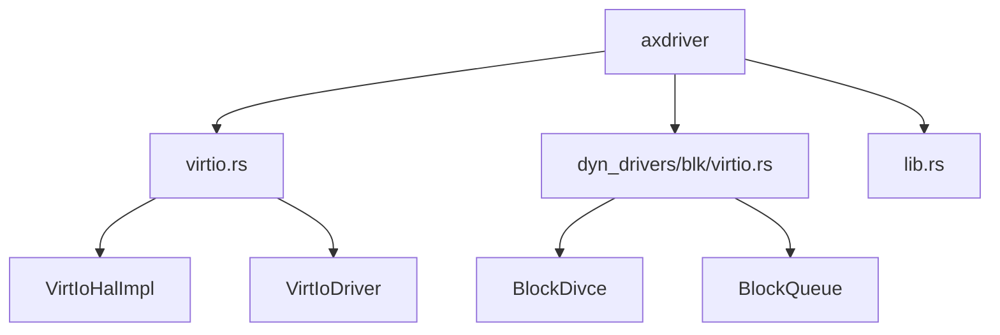
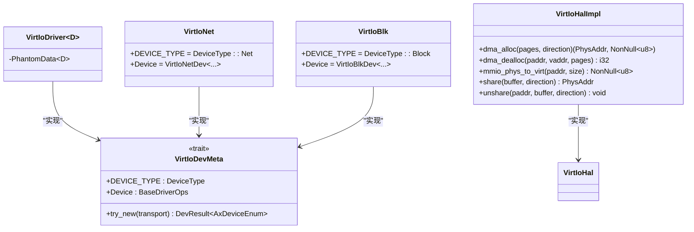
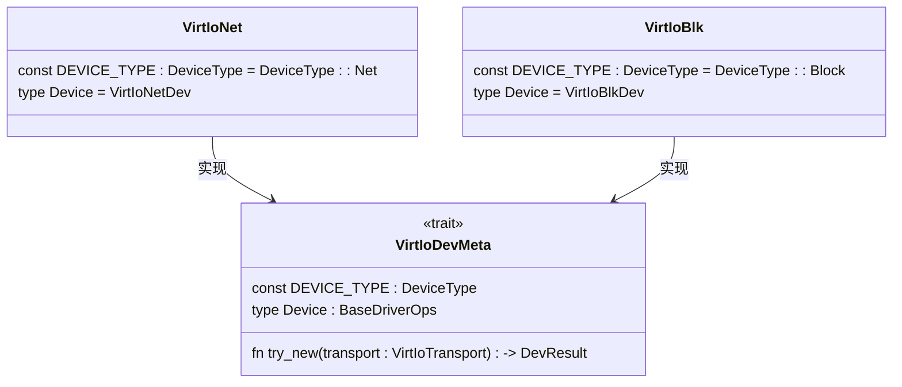
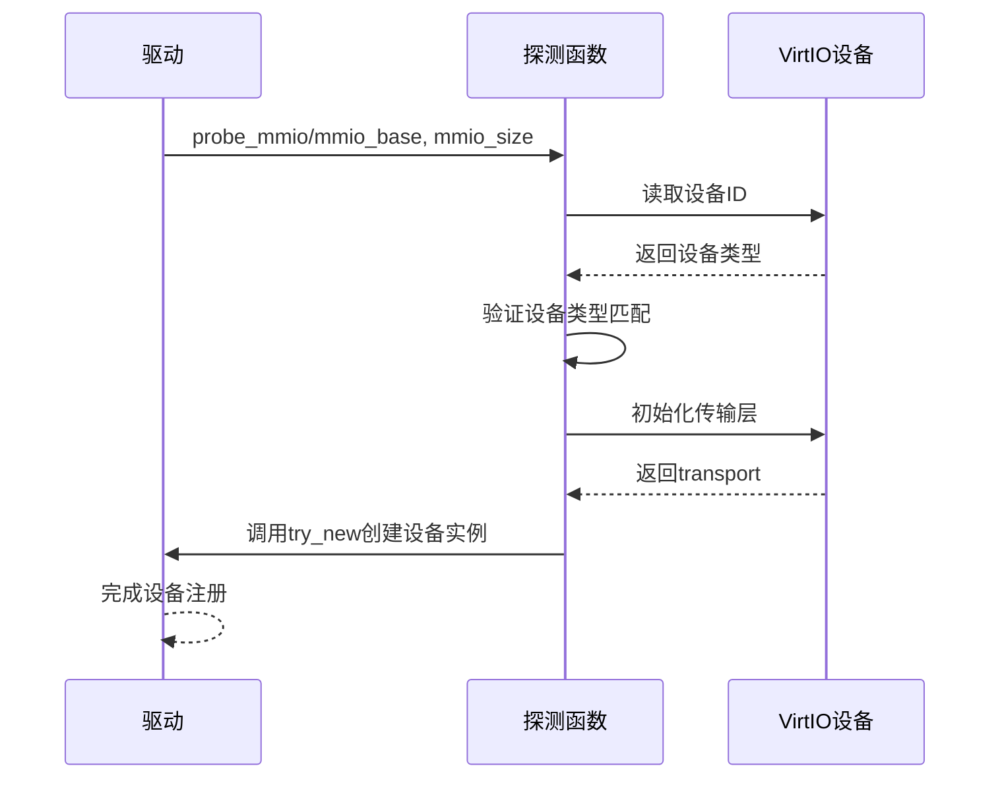
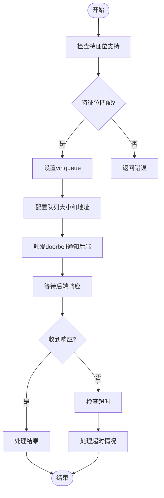
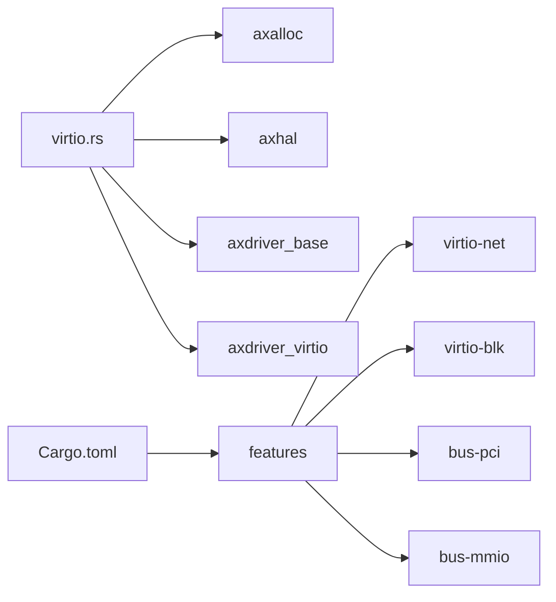

# VirtIO网络驱动实现

<cite>
**本文档引用的文件**
- [virtio.rs](file://modules/axdriver/src/virtio.rs)
- [blk/virtio.rs](file://modules/axdriver/src/dyn_drivers/blk/virtio.rs)
- [lib.rs](file://modules/axdriver/src/lib.rs)
- [Cargo.toml](file://modules/axdriver/Cargo.toml)
- [macros.rs](file://modules/axdriver/src/macros.rs)
</cite>

## 目录
1. [引言](#引言)
2. [项目结构](#项目结构)
3. [核心组件](#核心组件)
4. [架构概述](#架构概述)
5. [详细组件分析](#详细组件分析)
6. [依赖分析](#依赖分析)
7. [性能考量](#性能考量)
8. [故障排除指南](#故障排除指南)
9. [结论](#结论)

## 引言
本文档全面阐述了ArceOS中VirtIO网络设备驱动的工作原理。重点描述virtio-net协议协商过程，包括特征位协商、队列配置和控制通道初始化。深入解释virtqueue的可用/已用环结构及其内存布局，说明如何通过doorbell机制触发设备轮询。分析现代VirtIO特性如分散-聚集I/O、大页支持和多队列并行传输的实现方式。对比传统模拟网卡的性能优势，并结合代码实例说明在ArceOS中集成VirtIO驱动的方法。

## 项目结构
ArceOS的VirtIO驱动主要位于`modules/axdriver`模块中，采用条件编译特性来支持不同类型的VirtIO设备。驱动程序根据总线类型（PCI或MMIO）和设备类型（网络、块设备、显示）进行配置。

**图示来源**
- [virtio.rs](file://modules/axdriver/src/virtio.rs)
- [blk/virtio.rs](file://modules/axdriver/src/dyn_drivers/blk/virtio.rs)

**本节来源**
- [virtio.rs](file://modules/axdriver/src/virtio.rs)
- [Cargo.toml](file://modules/axdriver/Cargo.toml)

## 核心组件
VirtIO驱动的核心组件包括VirtIoHalImpl、VirtIoDriver以及针对不同设备类型的元信息结构体。这些组件共同实现了VirtIO设备的探测、初始化和操作。

**本节来源**
- [virtio.rs](file://modules/axdriver/src/virtio.rs#L0-L171)
- [lib.rs](file://modules/axdriver/src/lib.rs#L0-L25)

## 架构概述
ArceOS的VirtIO驱动架构采用分层设计，上层为通用驱动框架，下层为具体设备实现。通过VirtIoDevMeta trait定义设备元信息，实现对不同类型VirtIO设备的统一管理。

**图示来源**
- [virtio.rs](file://modules/axdriver/src/virtio.rs#L0-L171)

## 详细组件分析

### VirtIO设备元信息分析
VirtIO设备元信息通过VirtIoDevMeta trait定义，为每种设备类型提供统一的接口。该设计允许在编译时确定具体设备类型，避免动态调度开销。

#### 对象导向组件：

**图示来源**
- [virtio.rs](file://modules/axdriver/src/virtio.rs#L47-L76)

**本节来源**
- [virtio.rs](file://modules/axdriver/src/virtio.rs#L47-L171)

### 协议协商过程分析
VirtIO协议协商过程包括特征位协商、队列配置和控制通道初始化三个阶段。驱动首先探测设备存在性，然后通过读写设备寄存器完成特征协商。

#### API/服务组件：

**图示来源**
- [virtio.rs](file://modules/axdriver/src/virtio.rs#L75-L138)

### virtqueue机制分析
virtqueue是VirtIO设备前后端通信的核心数据结构，包含可用环和已用环两个部分。前端驱动通过doorbell机制通知后端处理新的请求。

#### 复杂逻辑组件：

**图示来源**
- [virtio.rs](file://modules/axdriver/src/virtio.rs#L138-L171)

## 依赖分析
VirtIO驱动依赖于多个底层模块，包括内存管理、PCI/MMIO总线访问和设备抽象层。这些依赖关系通过Cargo特征(feature)进行条件编译控制。

**图示来源**
- [Cargo.toml](file://modules/axdriver/Cargo.toml#L0-L40)
- [virtio.rs](file://modules/axdriver/src/virtio.rs)

**本节来源**
- [Cargo.toml](file://modules/axdriver/Cargo.toml#L0-L40)
- [virtio.rs](file://modules/axdriver/src/virtio.rs)

## 性能考量
VirtIO驱动通过零拷贝技术和批处理优化显著提升了虚拟机I/O性能。与传统模拟网卡相比，VirtIO减少了上下文切换次数和内存复制开销。

- **零拷贝**: 利用DMA直接访问物理内存
- **批处理**: 合并多个小请求减少中断频率
- **多队列**: 支持并行数据传输提高吞吐量
- **大页支持**: 减少TLB缺失率提升内存访问效率

## 故障排除指南
当VirtIO设备无法正常工作时，可按照以下步骤进行排查：

1. 检查QEMU命令行是否正确启用了virtio设备
2. 确认内核配置中已启用相应的virtio功能
3. 查看系统日志中是否有设备初始化失败的信息
4. 验证内存映射和中断配置是否正确

**本节来源**
- [virtio.rs](file://modules/axdriver/src/virtio.rs#L75-L100)
- [blk/virtio.rs](file://modules/axdriver/src/dyn_drivers/blk/virtio.rs#L0-L50)

## 结论
ArceOS中的VirtIO