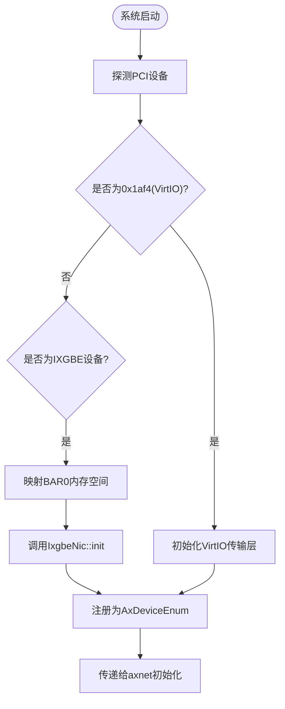
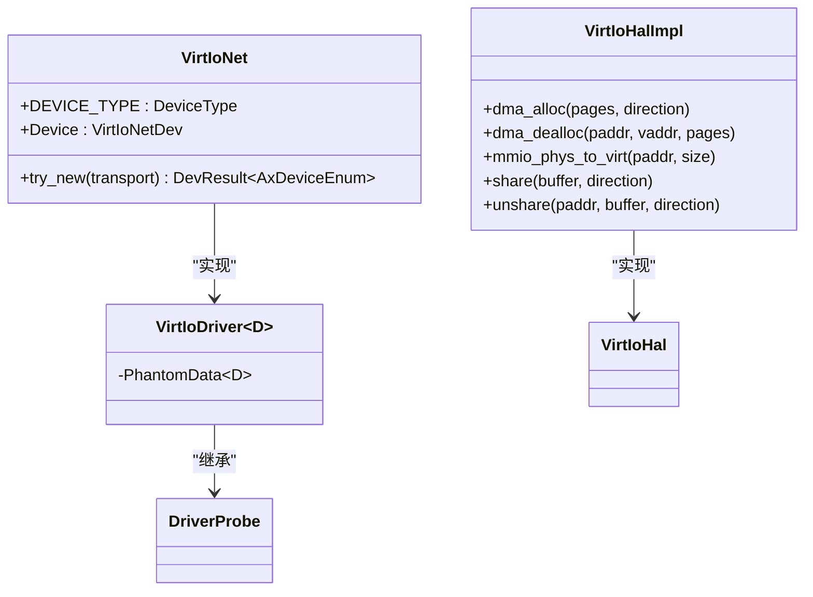
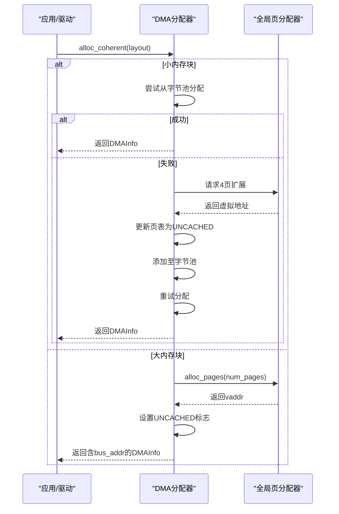
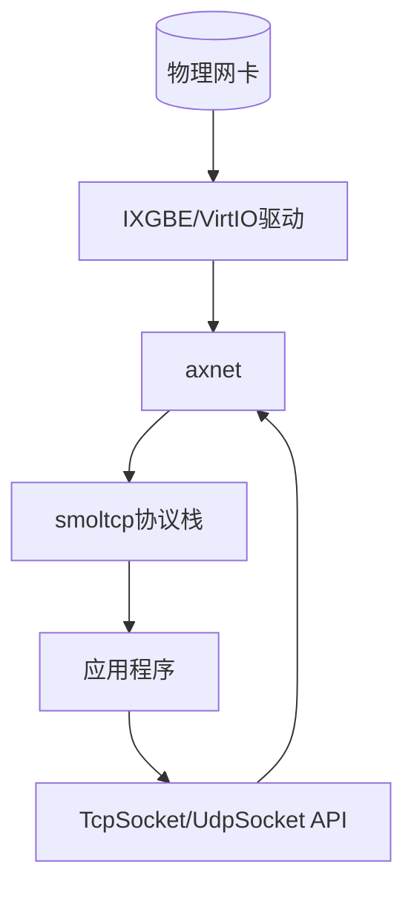

# 网络设备驱动

<cite>
**本文档中引用的文件**
- [ixgbe.rs](file://modules/axdriver/src/ixgbe.rs)
- [virtio.rs](file://modules/axdriver/src/virtio.rs)
- [lib.rs](file://modules/axnet/src/lib.rs)
- [dma.rs](file://modules/axdma/src/dma.rs)
- [drivers.rs](file://modules/axdriver/src/drivers.rs)
- [x86_64-pc-oslab.toml](file://configs/custom/x86_64-pc-oslab.toml)
</cite>

## 目录
1. [引言](#引言)
2. [项目结构与初始化流程](#项目结构与初始化流程)
3. [IXGBE驱动详解](#ixgbe驱动详解)
4. [VirtIO网络驱动分析](#virtio网络驱动分析)
5. [DMA内存管理机制](#dma内存管理机制)
6. [TX/RX环形队列工作原理](#txrx环形队列工作原理)
7. [中断处理与绑定机制](#中断处理与绑定机制)
8. [数据包接收路径与零拷贝优化](#数据包接收路径与零拷贝优化)
9. [axnet网络栈集成](#axnet网络栈集成)
10. [性能调优参数](#性能调优参数)

## 引言
本文档旨在深入解析ArceOS操作系统中的IXGBE和VirtIO两类网络设备驱动，涵盖从硬件初始化到上层协议栈交互的完整技术链条。重点阐述网卡初始化、MAC地址配置、收发队列设置、中断绑定等核心流程，并详细说明DMA映射、缓冲区回收及零拷贝优化机制。结合axnet网络子系统，揭示驱动层与TCP/IP协议栈之间的数据交互方式与性能优化策略。

## 项目结构与初始化流程
ArceOS的网络驱动模块主要分布在`modules/axdriver`目录下，其中`ixgbe.rs`和`virtio.rs`分别实现Intel X540/X550系列网卡和半虚拟化VirtIO网络设备的支持。系统启动时通过PCI枚举探测设备类型并加载相应驱动。

**Diagram sources**
- [drivers.rs](file://modules/axdriver/src/drivers.rs#L101-L134)
- [virtio.rs](file://modules/axdriver/src/virtio.rs#L102-L138)

**Section sources**
- [drivers.rs](file://modules/axdriver/src/drivers.rs#L101-L134)
- [virtio.rs](file://modules/axdriver/src/virtio.rs#L102-L138)

## IXGBE驱动详解
IXGBE驱动基于`axdriver_net::ixgbe`库构建，通过实现`IxgbeHal` trait完成底层资源管理。驱动在PCI总线探测阶段识别设备后，读取BAR0寄存器基址并进行虚拟地址映射。

### 网卡初始化
初始化过程包括：
- 配置收发队列数量（QN=1）和大小（QS=1024）
- 分配DMA一致性内存用于描述符环
- 设置中断向量与MSI-X表项
- 启动硬件并进入正常工作模式

**Section sources**
- [drivers.rs](file://modules/axdriver/src/drivers.rs#L101-L134)
- [ixgbe.rs](file://modules/axdriver/src/ixgbe.rs#L0-L38)

### MAC地址设置
MAC地址由硬件ROM提供，驱动通过访问设备特定偏移处的寄存器获取。当前代码未显式暴露MAC配置接口，依赖固件预设值。

## VirtIO网络驱动分析
VirtIO驱动采用通用架构设计，支持PCI和MMIO两种总线类型，通过`VirtIoTransport`抽象统一接口。

### 设备探测机制
驱动通过以下特征识别设备：
- **厂商ID**：必须为0x1af4
- **设备ID**：网络设备对应0x1000或0x1041
- **传输方式**：根据编译选项选择PCI或MMIO模式

**Diagram sources**
- [virtio.rs](file://modules/axdriver/src/virtio.rs#L48-L138)

**Section sources**
- [virtio.rs](file://modules/axdriver/src/virtio.rs#L48-L138)

### 收发队列配置
VirtIO网络设备默认使用64个描述符的环形队列（可通过泛型参数调整）。队列初始化时分配连续物理页作为描述符表存储区。

## DMA内存管理机制
DMA子系统位于`modules/axdma`模块，负责一致性内存的分配与释放，确保CPU与外设访问内存时缓存一致性。

### 内存分配策略
- 小于4KB请求：从专用字节分配器分配
- 大于等于4KB请求：直接申请整数个页面
- 所有DMA内存标记为UNCACHED属性以避免缓存副作用

**Diagram sources**
- [dma.rs](file://modules/axdma/src/dma.rs#L0-L128)

**Section sources**
- [dma.rs](file://modules/axdma/src/dma.rs#L0-L128)
- [ixgbe.rs](file://modules/axdriver/src/ixgbe.rs#L0-L38)

## TX/RX环形队列工作原理
IXGBE和VirtIO均采用双环结构管理数据包传输与接收。

### 描述符状态更新
- 发送完成后，硬件置位`DD`（Descriptor Done）标志
- 驱动轮询该标志判断发送完成情况
- 接收描述符由驱动预先填充缓冲区指针，硬件写入长度信息后触发中断

### 硬件同步机制
通过内存屏障（memory barrier）保证描述符写入顺序可见性，防止编译器或CPU乱序执行导致逻辑错误。

## 中断处理与绑定机制
当前实现中，IXGBE使用MSI-X多向量中断，每个队列可绑定独立中断号。VirtIO则依赖hypervisor注入虚拟中断。

### 中断绑定配置
在`x86_64-pc-oslab.toml`中定义了PCI ECAM空间和MMIO范围，但未明确指定中断亲和性设置。实际绑定由平台层自动完成。

**Section sources**
- [x86_64-pc-oslab.toml](file://configs/custom/x86_64-pc-oslab.toml#L34-L60)

## 数据包接收路径与零拷贝优化
数据包接收遵循以下路径：
1. 网卡DMA写入数据到预分配缓冲区
2. 触发中断通知CPU
3. 驱动回收已完成的数据包描述符
4. 将数据提交给axnet协议栈

### 缓冲区回收机制
驱动维护一个空闲缓冲区池，每次回收已处理包时将其重新加入池中供下次使用，避免频繁内存分配。

### 零拷贝优化
通过`share()`方法将用户缓冲区直接映射为DMA可访问地址，减少中间复制环节。此功能需配合支持scatter-gather的硬件使用。

**Section sources**
- [virtio.rs](file://modules/axdriver/src/virtio.rs#L139-L171)
- [dma.rs](file://modules/axdma/src/dma.rs#L0-L128)

## axnet网络栈集成
axnet模块作为统一网络接口层，封装底层驱动差异，向上提供POSIX风格API。

### 数据交互接口
- `init_network()`函数接收`AxDeviceContainer`类型的NIC设备
- 调用`smoltcp_impl::init(dev)`启动协议栈
- 提供`TcpSocket`和`UdpSocket`抽象类供应用程序使用

**Diagram sources**
- [lib.rs](file://modules/axnet/src/lib.rs#L0-L47)

**Section sources**
- [lib.rs](file://modules/axnet/src/lib.rs#L0-L47)

## 性能调优参数
关键可调参数包括：
- **QS (Queue Size)**：收发队列长度，默认1024
- **QN (Queue Number)**：队列数量，默认1
- **DMA页面大小**：影响内存利用率与TLB压力
- **轮询间隔**：决定中断频率与延迟平衡

这些参数可通过修改驱动初始化代码或添加运行时配置接口进行调整。