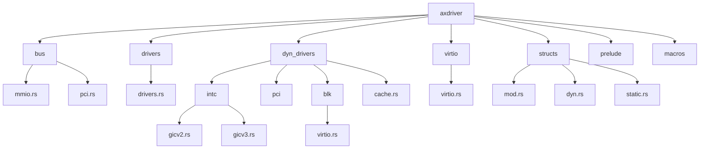
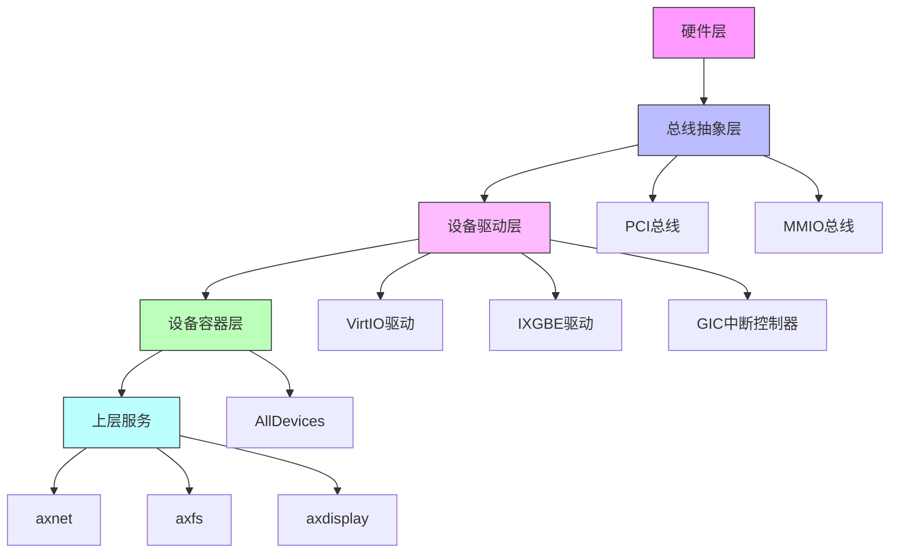
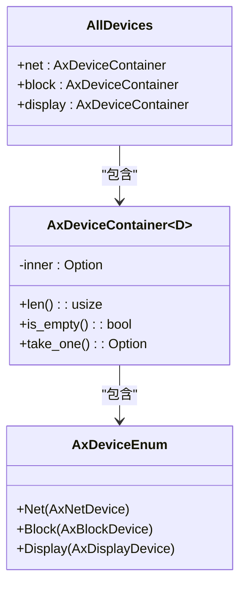
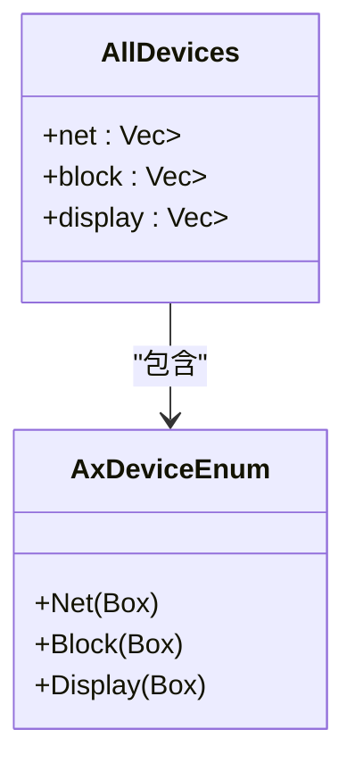
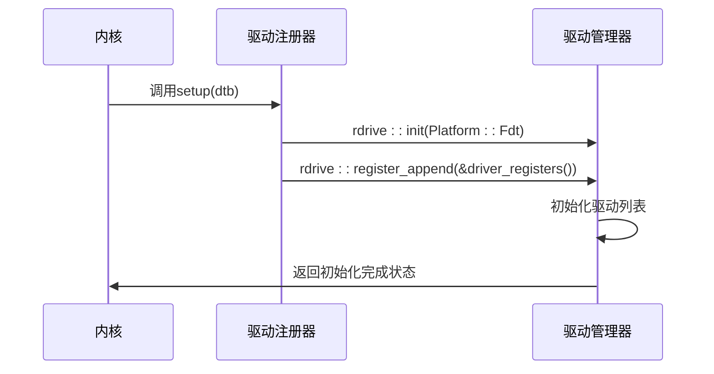
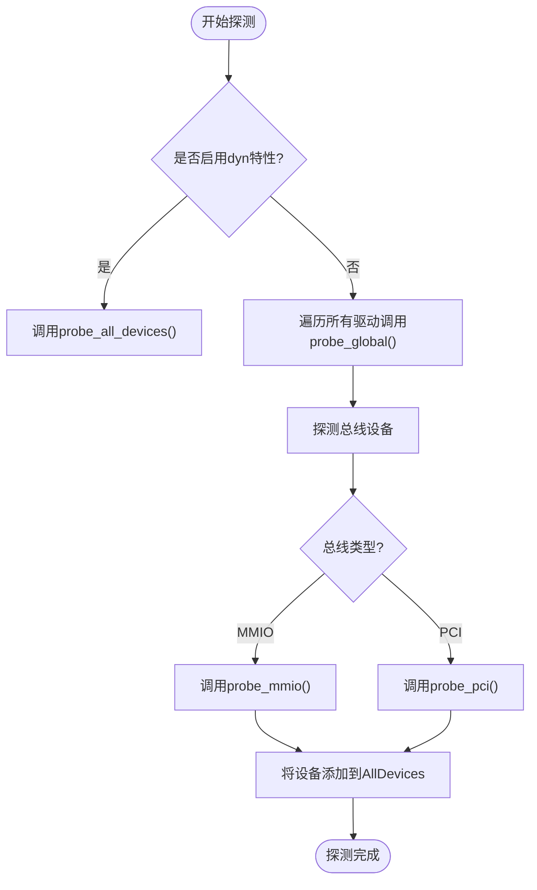
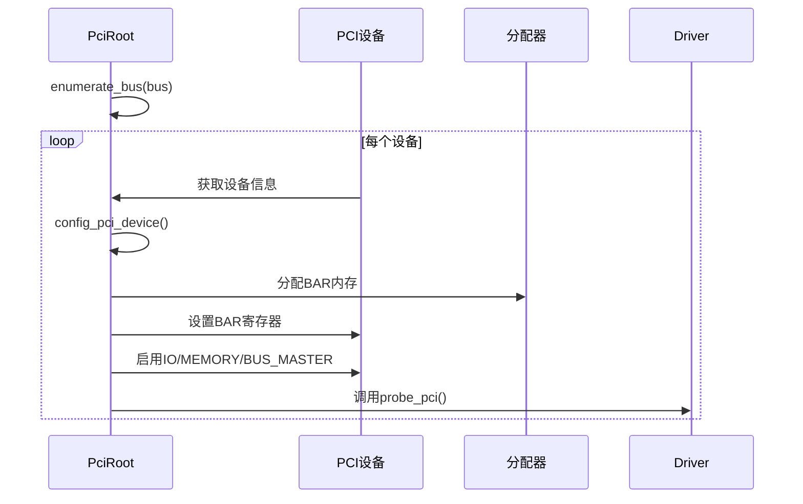
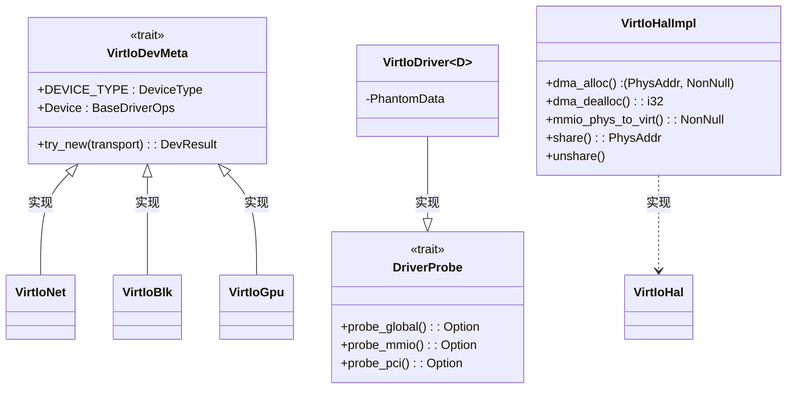

# 设备驱动框架

<cite>
**本文档引用的文件**
- [lib.rs](file://modules/axdriver/src/lib.rs)
- [drivers.rs](file://modules/axdriver/src/drivers.rs)
- [virtio.rs](file://modules/axdriver/src/virtio.rs)
- [mmio.rs](file://modules/axdriver/src/bus/mmio.rs)
- [pci.rs](file://modules/axdriver/src/bus/pci.rs)
- [gicv3.rs](file://modules/axdriver/src/dyn_drivers/intc/gicv3.rs)
- [gicv2.rs](file://modules/axdriver/src/dyn_drivers/intc/gicv2.rs)
- [blk/virtio.rs](file://modules/axdriver/src/dyn_drivers/blk/virtio.rs)
- [prelude.rs](file://modules/axdriver/src/prelude.rs)
- [structs/mod.rs](file://modules/axdriver/src/structs/mod.rs)
- [dyn.rs](file://modules/axdriver/src/structs/dyn.rs)
- [static.rs](file://modules/axdriver/src/structs/static.rs)
- [Cargo.toml](file://api/axfeat/Cargo.toml)
</cite>

## 目录
1. [简介](#简介)
2. [项目结构](#项目结构)
3. [核心组件](#核心组件)
4. [架构概述](#架构概述)
5. [详细组件分析](#详细组件分析)
6. [依赖分析](#依赖分析)
7. [性能考虑](#性能考虑)
8. [故障排除指南](#故障排除指南)
9. [结论](#结论)

## 简介
Arceos设备驱动框架为操作系统提供了一套完整的硬件抽象层，支持静态与动态两种设备模型。该框架通过统一的接口管理网络、块存储和显示等各类设备，实现了设备探测、注册和绑定的核心机制。框架设计了PCI和MMIO总线抽象层，支持VirtIO虚拟设备和GIC中断控制器等具体实现，并与上层模块如axnet、axfs进行交互。文档将深入解析驱动开发模式、I/O操作流程和中断处理机制，为开发者提供编写新设备驱动的规范指南。

## 项目结构
Arceos设备驱动框架的代码组织体现了清晰的分层架构，主要模块包括基础驱动功能、总线抽象、具体设备实现和动态驱动支持。



**图示来源**
- [lib.rs](file://modules/axdriver/src/lib.rs#L0-L198)
- [bus/mod.rs](file://modules/axdriver/src/bus/mod.rs#L0-L3)

**本节来源**
- [lib.rs](file://modules/axdriver/src/lib.rs#L0-L198)
- [project_structure](file://#L0-L1000)

## 核心组件
设备驱动框架的核心组件包括AllDevices结构体、驱动注册机制、总线抽象层和设备类型系统。AllDevices结构体作为所有检测到的设备的容器，根据设备类别（网络、块存储、显示）组织设备实例。框架支持静态和动态两种设备模型，通过编译时特性选择。驱动注册机制允许在系统初始化期间注册各种设备驱动，而总线抽象层则提供了对PCI和MMIO总线的统一访问接口。

**本节来源**
- [lib.rs](file://modules/axdriver/src/lib.rs#L114-L161)
- [prelude.rs](file://modules/axdriver/src/prelude.rs#L0-L9)
- [structs/mod.rs](file://modules/axdriver/src/structs/mod.rs#L0-L50)

## 架构概述
Arceos设备驱动框架采用分层架构设计，从底层硬件访问到上层服务提供完整的抽象。



**图示来源**
- [lib.rs](file://modules/axdriver/src/lib.rs#L0-L198)
- [bus/mmio.rs](file://modules/axdriver/src/bus/mmio.rs#L0-L23)
- [bus/pci.rs](file://modules/axdriver/src/bus/pci.rs#L0-L122)

## 详细组件分析

### 静态与动态设备模型
Arceos设备驱动框架支持两种设备模型：静态模型和动态模型，通过编译时特性`dyn`进行选择。

#### 静态设备模型
静态设备模型在编译时确定设备类型，避免了动态调度的开销，提供了最佳性能。然而，每个设备类别仅支持一个设备实例。



**图示来源**
- [structs/static.rs](file://modules/axdriver/src/structs/static.rs#L0-L47)
- [structs/mod.rs](file://modules/axdriver/src/structs/mod.rs#L0-L50)

#### 动态设备模型
动态设备模型使用trait对象并将其包装在`Box<dyn Trait>`中，支持同一类别下的多个设备实例，但会引入少量动态调度开销。



**图示来源**
- [structs/dyn.rs](file://modules/axdriver/src/structs/dyn.rs)
- [structs/mod.rs](file://modules/axdriver/src/structs/mod.rs#L0-L50)

**本节来源**
- [lib.rs](file://modules/axdriver/src/lib.rs#L0-L25)
- [Cargo.toml](file://api/axfeat/Cargo.toml#L46-L91)

### 驱动注册、探测和绑定机制
设备驱动框架提供了完善的驱动注册、探测和绑定机制，确保设备能够被正确识别和初始化。

#### 驱动注册流程
驱动注册机制通过全局符号`__sdriver_register`和`__edriver_register`来标识驱动注册表的开始和结束位置。



**图示来源**
- [dyn_drivers/mod.rs](file://modules/axdriver/src/dyn_drivers/mod.rs#L48-L73)
- [lib.rs](file://modules/axdriver/src/lib.rs#L163-L197)

#### 驱动探测与绑定
框架通过probe机制发现和绑定设备，支持全局探测、MMIO探测和PCI探测三种方式。



**图示来源**
- [lib.rs](file://modules/axdriver/src/lib.rs#L114-L161)
- [drivers.rs](file://modules/axdriver/src/drivers.rs#L0-L56)
- [virtio.rs](file://modules/axdriver/src/virtio.rs#L75-L100)

**本节来源**
- [lib.rs](file://modules/axdriver/src/lib.rs#L114-L161)
- [drivers.rs](file://modules/axdriver/src/drivers.rs#L0-L56)
- [virtio.rs](file://modules/axdriver/src/virtio.rs#L75-L138)

### 总线抽象层设计
设备驱动框架提供了PCI和MMIO两种总线的抽象层，为上层驱动提供统一的硬件访问接口。

#### PCI总线抽象
PCI总线抽象层负责配置PCI设备，分配内存资源，并枚举总线上的设备。



**图示来源**
- [bus/pci.rs](file://modules/axdriver/src/bus/pci.rs#L0-L122)
- [drivers.rs](file://modules/axdriver/src/drivers.rs#L101-L134)

#### MMIO总线抽象
MMIO总线抽象层通过设备树信息探测和配置基于内存映射I/O的设备。

```mermaid
flowchart TD
A[开始MMIO探测] --> B{是否启用virtio特性?}
B --> |是| C[遍历VIRTIO_MMIO_RANGES]
C --> D[调用Driver::probe_mmio()]
D --> E{探测成功?}
E --> |是| F[添加设备到AllDevices]
E --> |否| G[继续下一个范围]
G --> H{还有更多范围?}
H --> |是| C
H --> |否| I[探测完成]
F --> I
```

**图示来源**
- [bus/mmio.rs](file://modules/axdriver/src/bus/mmio.rs#L0-L23)
- [config.go](file://config/config.go#L10-L30)

**本节来源**
- [bus/pci.rs](file://modules/axdriver/src/bus/pci.rs#L0-L122)
- [bus/mmio.rs](file://modules/axdriver/src/bus/mmio.rs#L0-L23)

### VirtIO设备驱动实现
VirtIO设备驱动是框架中的重要组成部分，支持网络、块存储和显示等虚拟设备。

#### VirtIO驱动架构
VirtIO驱动采用元数据驱动的设计模式，通过VirtIoDevMeta trait定义设备元信息。



**图示来源**
- [virtio.rs](file://modules/axdriver/src/virtio.rs#L45-L171)
- [drivers.rs](file://modules/axdriver/src/drivers.rs#L58-L99)

#### VirtIO网络设备流程
VirtIO网络设备的I/O操作流程涉及虚拟队列的管理和数据包的传输接收。

```mermaid
sequenceDiagram
    participant App as 应用程序
    participant AxNet as axnet
    participant VirtioNet as VirtioNetDev
    participant Hardware as 硬件
    
    App->>AxNet: 发送数据包
    AxNet->>