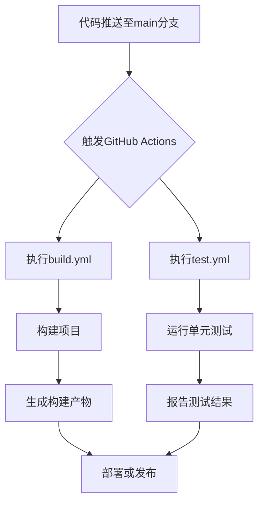

# 贡献指南

<cite>
**本文档引用的文件**
- [README.md](file://README.md)
- [rust-toolchain.toml](file://rust-toolchain.toml)
- [Cargo.toml](file://Cargo.toml)
- [Makefile](file://Makefile)
- [doc/README.md](file://doc/README.md)
- [tools/deptool/src/main.rs](file://tools/deptool/src/main.rs)
- [modules/axns/tests/test_global.rs](file://modules/axns/tests/test_global.rs)
- [modules/axns/tests/test_thread_local.rs](file://modules/axns/tests/test_thread_local.rs)
</cite>

## 目录
1. [简介](#简介)
2. [代码风格规范](#代码风格规范)
3. [提交信息格式](#提交信息格式)
4. [测试策略](#测试策略)
5. [CI/CD流水线](#cicd流水线)
6. [开发流程](#开发流程)
7. [安全与性能考量](#安全与性能考量)

## 简介
ArceOS是一个用Rust编写的实验性模块化操作系统（或单体内核）。本贡献指南旨在为社区参与项目开发提供清晰的指导，涵盖代码风格、测试策略、持续集成流程以及新功能开发的标准实践。

**Section sources**
- [README.md](file://README.md#L0-L217)

## 代码风格规范
所有代码必须遵循Rust官方格式化工具rustfmt和静态检查工具clippy的规范。项目通过`rust-toolchain.toml`文件明确指定了所需的工具链组件，包括`rustfmt`和`clippy`。

可以通过执行以下命令来格式化整个项目的代码：
```bash
make fmt
```

对于C语言部分的代码，使用clang-format进行格式化：
```bash
make fmt_c
```

**Section sources**
- [rust-toolchain.toml](file://rust-toolchain.toml#L0-L10)
- [Makefile](file://Makefile#L218-L229)

## 提交信息格式
虽然文档中没有明确规定提交信息的具体格式，但建议遵循清晰、简洁的原则，准确描述更改的内容和目的。提交信息应能帮助其他开发者快速理解变更的上下文和影响。

## 测试策略
### 单元测试与集成测试
单元测试和集成测试通常位于相应模块的`tests`目录下。例如，`axns`模块的测试文件位于`modules/axns/tests/`目录中，包含`test_global.rs`和`test_thread_local.rs`等测试文件。

运行测试的命令如下：
```bash
make unittest
```

此命令将执行项目中的所有单元测试。

### 测试位置
测试代码主要分布在各个模块的`tests`子目录中，确保每个功能模块都有对应的测试覆盖。

**Section sources**
- [modules/axns/tests/test_global.rs](file://modules/axns/tests/test_global.rs)
- [modules/axns/tests/test_thread_local.rs](file://modules/axns/tests/test_thread_local.rs)
- [Makefile](file://Makefile#L230-L232)

## CI/CD流水线
ArceOS使用GitHub Actions作为其CI/CD流水线的基础。从项目根目录的README文件可以看出，存在两个主要的工作流：`build.yml`和`test.yml`，分别负责构建和测试任务。

这些工作流会在每次推送代码到主分支时自动触发，确保代码的质量和稳定性。具体的流水线配置文件位于`.github/workflows/`目录下（尽管在当前上下文中未直接显示该路径）。

**Diagram sources**
- [README.md](file://README.md#L1-L10)



**Section sources**
- [README.md](file://README.md#L1-L10)

## 开发流程
### 新功能开发
1. 创建新的功能分支。
2. 实现新功能并编写相应的测试。
3. 确保代码符合rustfmt和clippy的规范。
4. 提交更改并通过CI/CD流水线验证。

### 缺陷修复
1. 定位问题并创建修复分支。
2. 编写修复代码，并添加必要的测试以防止回归。
3. 遵循代码风格规范进行提交。
4. 通过CI/CD流水线验证修复效果。

### 文档改进
1. 更新相关文档以反映最新的变化。
2. 确保文档内容准确无误，易于理解。
3. 提交文档更新并与代码更改一同审查。

**Section sources**
- [README.md](file://README.md#L0-L217)

## 安全与性能考量
在贡献代码时，必须重视安全编码实践和性能优化。所有贡献都应经过严格的测试，确保不会引入安全漏洞或性能瓶颈。特别是在处理内存管理、并发控制和网络通信等功能时，需要特别注意潜在的风险点。

**Section sources**
- [README.md](file://README.md#L0-L217)