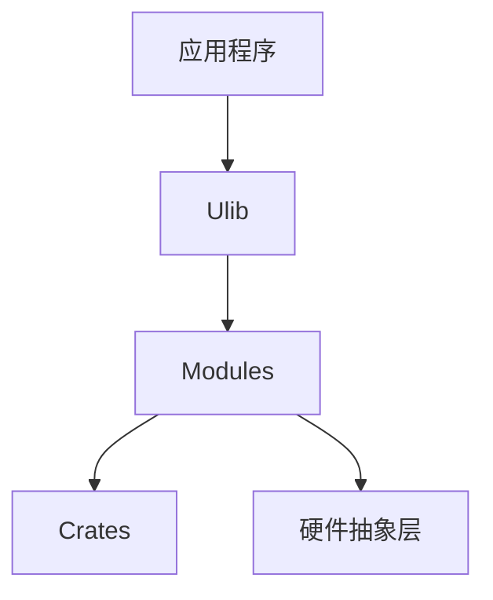
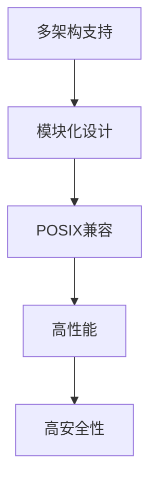
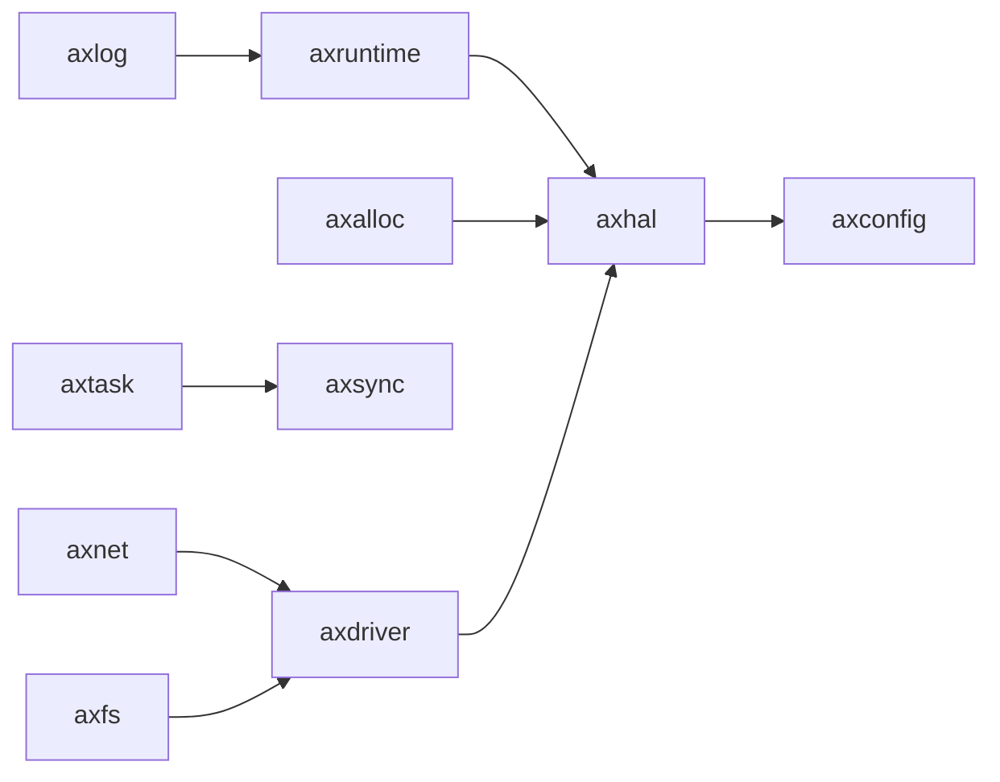

# 项目概述

<cite>
**本文档引用的文件**
- [README.md](file://README.md)
- [doc/README.md](file://doc/README.md)
- [api/arceos_api/src/lib.rs](file://api/arceos_api/src/lib.rs)
- [api/arceos_posix_api/src/lib.rs](file://api/arceos_posix_api/src/lib.rs)
- [modules/axruntime/src/lib.rs](file://modules/axruntime/src/lib.rs)
- [modules/axhal/src/lib.rs](file://modules/axhal/src/lib.rs)
- [modules/axtask/src/lib.rs](file://modules/axtask/src/lib.rs)
- [modules/axnet/src/lib.rs](file://modules/axnet/src/lib.rs)
- [modules/axfs/src/lib.rs](file://modules/axfs/src/lib.rs)
- [modules/axdriver/src/lib.rs](file://modules/axdriver/src/lib.rs)
- [ulib/axstd/src/lib.rs](file://ulib/axstd/src/lib.rs)
- [ulib/axlibc/src/lib.rs](file://ulib/axlibc/src/lib.rs)
- [examples/helloworld/src/main.rs](file://examples/helloworld/src/main.rs)
- [examples/httpserver/src/main.rs](file://examples/httpserver/src/main.rs)
</cite>

## 目录
1. [简介](#简介)
2. [核心目标与设计理念](#核心目标与设计理念)
3. [单体内核架构优势](#单体内核架构优势)
4. [Rust语言选择原因](#rust语言选择原因)
5. [目标受众](#目标受众)
6. [整体愿景](#整体愿景)
7. [代码库结构分析](#代码库结构分析)
8. [典型应用场景示例](#典型应用场景示例)
9. [学习路径指引](#学习路径指引)

## 简介

ArceOS 是一个用 Rust 编写的实验性模块化操作系统（或单体内核）。该项目受到 Unikraft 的启发，旨在通过高度模块化的设计实现组件解耦和可重用性。系统支持多种架构（x86_64、riscv64、aarch64、loongarch64）和平台（QEMU pc-q35、virt 等），并提供多线程、文件系统、网络栈等核心功能。

**Section sources**
- [README.md](file://README.md#L1-L218)

## 核心目标与设计理念

ArceOS 的核心设计原则是根据组件与操作系统概念的相关性进行划分，以降低组件间的耦合度并提高可重用性。该系统采用分层架构，将功能划分为 crates、模块和用户库三个层次：

- **Crates**：与操作系统无关的组件，可在其他项目中直接复用。
- **Modules**：与操作系统设计紧密相关的组件，如内存管理、任务调度等。
- **Ulib**：用户级库，为应用程序提供标准接口。

这种分层设计使得开发者可以根据需要灵活选择和组合不同模块，构建定制化的操作系统实例。

**Diagram sources**
- [doc/README.md](file://doc/README.md#L1-L48)

**Section sources**
- [doc/README.md](file://doc/README.md#L1-L48)

## 单体内核架构优势

ArceOS 采用单体内核（unikernel）架构，具有以下显著优势：

1. **高性能**：应用程序与操作系统运行在同一地址空间，避免了传统操作系统中频繁的用户态/内核态切换开销。
2. **高安全性**：极小的攻击面，仅包含应用程序实际需要的功能模块。
3. **资源效率**：精简的内存占用和启动时间，适合嵌入式和云原生环境。
4. **确定性行为**：消除了多进程竞争带来的不确定性，便于调试和验证。

该架构特别适用于构建专用服务器、物联网设备和安全关键系统。

**Section sources**
- [README.md](file://README.md#L1-L218)

## Rust语言选择原因

ArceOS 选择 Rust 作为系统级开发语言，主要基于以下几点考虑：

1. **内存安全**：Rust 的所有权系统从根本上防止了空指针、缓冲区溢出等常见内存错误。
2. **零成本抽象**：高级语言特性不会带来运行时性能损失。
3. **并发安全**：编译器强制检查数据竞争，确保多线程程序的安全性。
4. **现代工具链**：Cargo 包管理器和丰富的生态系统极大提升了开发效率。
5. **无运行时依赖**：`#![no_std]` 支持使得 Rust 代码可以直接在裸机上运行。

这些特性完美契合操作系统开发对安全性、性能和可靠性的严苛要求。

**Section sources**
- [README.md](file://README.md#L1-L218)

## 目标受众

ArceOS 主要面向以下三类用户群体：

1. **操作系统开发者**：希望探索新型操作系统架构的研究人员和工程师。
2. **嵌入式工程师**：需要构建高性能、低资源消耗专用系统的开发者。
3. **系统编程学习者**：希望通过实践深入理解操作系统原理的学生和爱好者。

无论是进行学术研究、产品开发还是技术学习，ArceOS 都提供了理想的实验平台。

**Section sources**
- [README.md](file://README.md#L1-L218)

## 整体愿景

ArceOS 的长期发展愿景包括以下几个方面：

### 多架构支持
系统已支持 x86_64、aarch64、riscv64 和 loongarch64 四种主流架构，未来将继续扩展对更多硬件平台的支持。

### 模块化设计原则
遵循"按需启用"的原则，每个功能模块都是可选的，开发者可以通过 Cargo 特性（features）机制灵活配置系统功能。

### POSIX兼容性目标
通过 `arceos_posix_api` 模块提供 POSIX 兼容的 API 接口，逐步实现与 Linux 应用程序的兼容。

### 高性能保障机制
采用每 CPU 运行队列（per-cpu run queue）的 SMP 调度策略，并支持 FIFO、RR 和 CFS 多种调度算法。

### 高安全性保障机制
利用 Rust 语言特性保证内存安全，结合硬件虚拟化技术提供更强的安全隔离。

**Diagram sources**
- [README.md](file://README.md#L1-L218)
- [api/arceos_posix_api/src/lib.rs](file://api/arceos_posix_api/src/lib.rs#L1-L61)

**Section sources**
- [README.md](file://README.md#L1-L218)
- [api/arceos_posix_api/src/lib.rs](file://api/arceos_posix_api/src/lib.rs#L1-L61)

## 代码库结构分析

ArceOS 的代码库采用清晰的目录结构组织各个组件：

- **api/**：定义操作系统对外提供的公共 API。
- **configs/**：存放各种平台的配置文件。
- **doc/**：项目文档和说明。
- **examples/**：示例应用程序。
- **modules/**：核心功能模块。
- **scripts/net/**：网络相关脚本。
- **tools/**：辅助开发工具。
- **ulib/**：用户级库。

各主要模块之间的依赖关系如下：

**Diagram sources**
- [project_structure](file://.)
- [modules/axruntime/src/lib.rs](file://modules/axruntime/src/lib.rs#L1-L312)

**Section sources**
- [project_structure](file://.)
- [modules/axruntime/src/lib.rs](file://modules/axruntime/src/lib.rs#L1-L312)

## 典型应用场景示例

### Hello World 示例
最简单的应用程序展示了如何使用 axstd 库输出文本信息。这个例子体现了 ArceOS 应用程序的基本结构：无需标准库依赖，通过 `#[unsafe(no_mangle)]` 标记主函数入口。

**Section sources**
- [examples/helloworld/src/main.rs](file://examples/helloworld/src/main.rs#L1-L11)

### HTTP服务器示例
httpserver 示例实现了完整的 TCP 服务器功能，展示了 ArceOS 在网络编程方面的强大能力。该示例包含：
- TCP 监听和连接处理
- 多线程客户端处理
- HTTP 协议解析和响应生成
- 日志记录功能

此应用可用于性能基准测试，验证系统的网络吞吐能力和并发处理能力。

**Section sources**
- [examples/httpserver/src/main.rs](file://examples/httpserver/src/main.rs#L1-L97)

## 学习路径指引

### 初学者入门
1. 阅读 README.md 了解基本构建和运行方法
2. 分析 helloworld 示例掌握基础编程模式
3. 尝试修改示例代码并观察运行结果
4. 参考文档学习各模块的 API 使用方法

### 进阶学习
1. 深入研究 axruntime 模块的初始化流程
2. 分析 axtask 模块的任务调度机制
3. 探索 axnet 模块的网络协议栈实现
4. 理解 axdriver 模块的设备驱动框架

### 高级用户扩展
1. 开发自定义设备驱动
2. 实现新的文件系统
3. 优化调度算法
4. 添加对新硬件平台的支持

通过循序渐进的学习路径，开发者可以全面掌握 ArceOS 的设计思想和技术细节，进而进行创新性的二次开发。

**Section sources**
- [README.md](file://README.md#L1-L218)
- [examples/helloworld/src/main.rs](file://examples/helloworld/src/main.rs#L1-L11)
- [examples/httpserver/src/main.rs](file://examples/httpserver/src/main.rs#L1-L97)